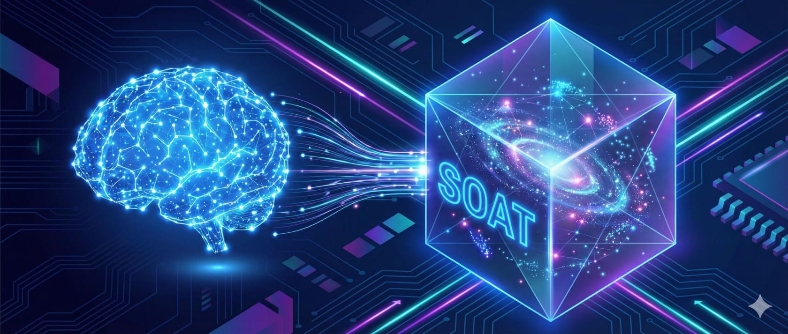

# SOAT — Infrastructure for AI Apps

<p align="center">
  
</p>

[](https://opensource.org/licenses/MIT)
[](https://safeskill.dev/scan/ttoss-soat)

**SOAT** is open-source infrastructure for building AI applications. It provides the essential backend services — identity and access management, document and file storage with vector search, conversational memory, agent orchestration, and a full MCP server — so you can focus on your product instead of reinventing the plumbing.

## Why SOAT?

Building AI applications requires a surprising amount of backend infrastructure: user management, API keys, persistent storage, semantic search, conversation history, agent execution, and tool integration. SOAT provides all of this out of the box.

- **Complete IAM**: Users, projects, API keys, and fine-grained permissions.
- **Documents & Files**: Ingestion, vector embeddings, and semantic search powered by [pgvector](https://github.com/pgvector/pgvector).
- **Conversations & Actors**: Multi-party dialogue management with persistent message history.
- **Agents & AI Providers**: Configure LLM providers, define agents with tools, and run AI-powered chat completions.
- **MCP Native**: First-class support for the [Model Context Protocol](https://modelcontextprotocol.io/), enabling seamless integration with agent runtimes.
- **REST API**: Standard HTTP endpoints for universal application access.

## Documentation

**[Read the Full Documentation](https://soat.ttoss.dev)** — Architecture, API reference, and deployment guides.

## Getting Started

The quickest way to get started is using Docker Compose.

1. **Clone the repository**

   ```bash
   git clone https://github.com/ttoss/soat.git
   cd soat
   ```

2. **Follow the [Getting Started Guide](https://soat.ttoss.dev/docs/getting-started)** to spin up the server and database using Docker Compose.

## Contributing

We welcome contributions! Please feel free to submit issues and pull requests.

## License

This project is licensed under the MIT License - see the [LICENSE](LICENSE) file for details.

## Acknowledgments

- [ttoss](https://ttoss.dev) - For the HTTP server and MCP packages
- [pgvector](https://github.com/pgvector/pgvector) - PostgreSQL vector similarity search
- [Ollama](https://ollama.com) - Local LLM and embedding models
