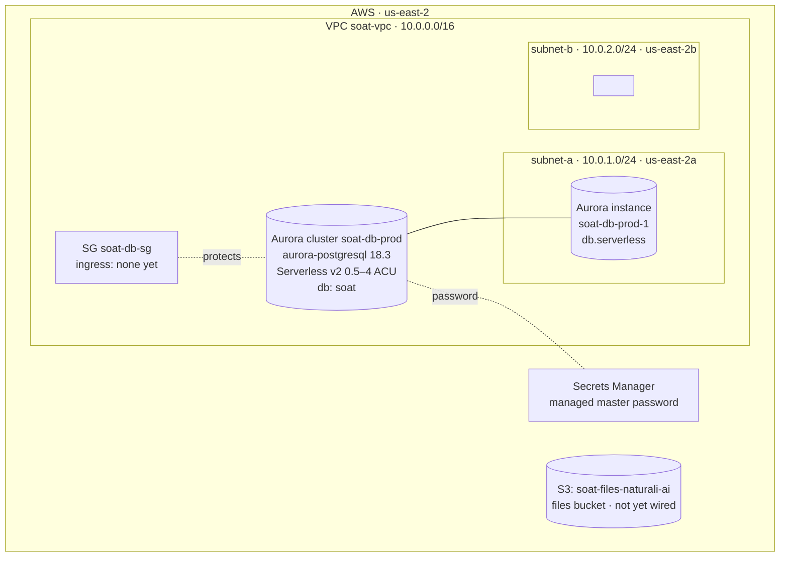

# SOAT on AWS — As-Built Architecture (Budget tier, in progress)

Current state of the SOAT infrastructure actually provisioned in AWS, built
step-by-step via the CLI. This is the **as-built** record — what exists right
now — as distinct from:

- `aws-infrastructure.md` — the **target** design (full standard-tier architecture)
- `aws-bringup-runbook.md` — the **commands** used to build it
- `aws-cost-tiers.md` — the budget / middle / standard **cost tiers**

**Region:** `us-east-2` &nbsp;·&nbsp; **Environment:** `prod` &nbsp;·&nbsp;
**Tier:** budget &nbsp;·&nbsp; **Status:** database + storage created; compute
layer not yet started.

## Current architecture



> Everything above is **created and (for Aurora) billing**. The compute layer —
> internet gateway, ECS, ALB, application secrets, container image — is **not
> yet built**; see [Next steps](#next-steps).

## Resource inventory

| # | Resource | Type | Name / Identifier | Key configuration |
|---|---|---|---|---|
| 1 | Files bucket | S3 | `soat-files-naturali-ai` | Block-all-public-access ON; SSE-S3 + bucket keys; versioning ON; lifecycle aborts incomplete multipart uploads after 7 days. **Not yet used by the app** (needs the S3 storage-backend code change). |
| 2 | Network | VPC | `soat-vpc` (`vpc-…`) | CIDR `10.0.0.0/16`; DNS hostnames + resolution enabled. |
| 3 | Subnet A | Subnet | `soat-subnet-a` / `subnet-015e18d19e812b7bb` | `10.0.1.0/24`, AZ `us-east-2a`. |
| 4 | Subnet B | Subnet | `soat-subnet-b` / `subnet-0254e0a45f304d167` | `10.0.2.0/24`, AZ `us-east-2b`. |
| 5 | DB security group | Security Group | `soat-db-sg` / `sg-0ad4386d810fd2d10` | **No ingress rule yet** — the "allow 5432 from the ECS service SG" rule is added when the compute layer is built. DB unreachable until then (intended). |
| 6 | DB subnet group | RDS subnet group | `soat-db-subnet-group` | Spans subnet-a + subnet-b (Aurora requires ≥2 AZs). |
| 7 | Aurora cluster | RDS Aurora | `soat-db-prod` | Engine `aurora-postgresql` **18.3**; **Serverless v2**, scaling **0.5–4 ACU**; storage encrypted; automated backups 7 days; initial database **`soat`**; master user **`soat_admin`**; master password managed in Secrets Manager. |
| 8 | Aurora instance | RDS Aurora instance | `soat-db-prod-1` | Class `db.serverless`; **not publicly accessible**. |
| 9 | DB master password | Secrets Manager | `rds!cluster-…` (auto-created) | Auto-generated + rotated by RDS via `--manage-master-user-password`. ARN referenced by the ECS task later. |

### Values to carry into the next parts

```bash
# Fill these from your shell (some were captured during bring-up):
AWS_REGION=us-east-2
SOAT_ENV=prod
FILES_BUCKET=soat-files-naturali-ai
VPC_ID=vpc-…                      # aws ec2 describe-vpcs --filters Name=tag:Name,Values=soat-vpc
SUBNET1=subnet-015e18d19e812b7bb  # us-east-2a
SUBNET2=subnet-0254e0a45f304d167  # us-east-2b
DB_SG=sg-0ad4386d810fd2d10
DB_HOST=…                         # aws rds describe-db-clusters --db-cluster-identifier soat-db-prod --query 'DBClusters[0].Endpoint'
DB_SECRET_ARN=…                   # aws rds describe-db-clusters --db-cluster-identifier soat-db-prod --query 'DBClusters[0].MasterUserSecret.SecretArn'
DB_NAME=soat
DB_PORT=5432
```

## Application database

No separate application database is needed — the logical database **`soat`**
was created inside the cluster by the `--database-name soat` flag. On first
boot the SOAT server will, inside that database:

1. run `sequelize.sync({ alter: true })` to create all tables, and
2. run `CREATE EXTENSION vector` (the app initializes with
   `createVectorExtension: true`; the `soat_admin` master user has the privilege
   to create the `vector` trusted extension).

## Key decisions made during bring-up

| Decision | Choice | Rationale |
|---|---|---|
| Provisioning method | Manual AWS CLI (S3 + DB), Terraform later for compute | Keep stateful stores out of Terraform's lifecycle so `terraform destroy` on compute can't wipe data. |
| Database engine | **Aurora PostgreSQL** (not community RDS) | User opted to start on Aurora for read-replica scaling, faster failover, and storage autoscaling as SOAT grows. |
| Capacity model | **Serverless v2**, 0.5–4 ACU | Auto-scales with bursty agent/ingestion load; no fixed instance-size decision. Won't scale to zero because SOAT's schedulers keep the DB busy. |
| Postgres version | **18.3** | Matches the dev environment (PG18); Aurora offers 18.3 in this region. pgvector on PG18 is validated by the app's first-boot `CREATE EXTENSION` (empty DB → free fallback to 16.x if ever needed). |
| Network posture | Public subnets + strict SGs, no NAT | Budget-tier posture (~$70/mo target); DB stays private (`no-publicly-accessible`) and unreachable until the service SG rule is added. |
| Secrets | RDS-managed master password in Secrets Manager | No plaintext password handling; automatic rotation. |

## Cost snapshot (currently billing)

| Resource | Approx. cost |
|---|---|
| Aurora Serverless v2 | ~$43/mo floor at 0.5 ACU (scales up under load), + storage (~$0.10/GB-mo) + I/O |
| S3 bucket | ~$0 until populated |
| VPC, subnets, security group, subnet group | free |
| Secrets Manager (RDS-managed) | ~$0.40/mo per secret |
| **Current total** | **~$44/mo** |

> Note: this exceeds the ~$14 community-RDS line in the budget tier because
> Aurora Serverless v2 has a ~$43/mo floor. It's the deliberate "start on
> Aurora" trade-off.

## Next steps

Not yet created — the compute layer and its prerequisites:

1. **Internet gateway + route tables** — public egress/ingress for the ECS tasks and ALB.
2. **ECS service security group** + the **`soat-db-sg` ingress rule** ("allow 5432 from the service SG").
3. **Application secrets in Secrets Manager** — `JWT_SECRET`, `SECRETS_ENCRYPTION_KEY` (64-char hex).
4. **Container image** — ECR repository (or pull `ttoss/soat:latest` from Docker Hub).
5. **ECS cluster + task definition + service** — the SOAT server on port `5047`.
6. **Application Load Balancer** — target group (health check `/health`), listener, raised idle timeout for long LLM generations.

### Code prerequisites (tracked separately)

- **S3 storage backend** — `packages/server/src/lib/files.ts` writes to local disk today; the `soat-files-naturali-ai` bucket is idle until an `s3` storage driver lands.
- **Hosted embedding provider** — `packages/server/src/lib/embedding.ts` supports only Ollama; knowledge/document search returns `EMBEDDING_NOT_CONFIGURED` until a Bedrock/OpenAI branch is added (or Ollama is run).

## Teardown (current resources)

```bash
# Aurora: delete the instance, then the cluster
aws rds delete-db-instance --db-instance-identifier soat-db-prod-1
aws rds delete-db-cluster --db-cluster-identifier soat-db-prod --skip-final-snapshot
# S3: delete bucket and contents
aws s3 rb "s3://soat-files-naturali-ai" --force
# Network (after the above are gone): subnet group, SG, subnets, VPC
aws rds delete-db-subnet-group --db-subnet-group-name soat-db-subnet-group
aws ec2 delete-security-group --group-id sg-0ad4386d810fd2d10
aws ec2 delete-subnet --subnet-id subnet-015e18d19e812b7bb
aws ec2 delete-subnet --subnet-id subnet-0254e0a45f304d167
aws ec2 delete-vpc --vpc-id "$VPC_ID"
```
