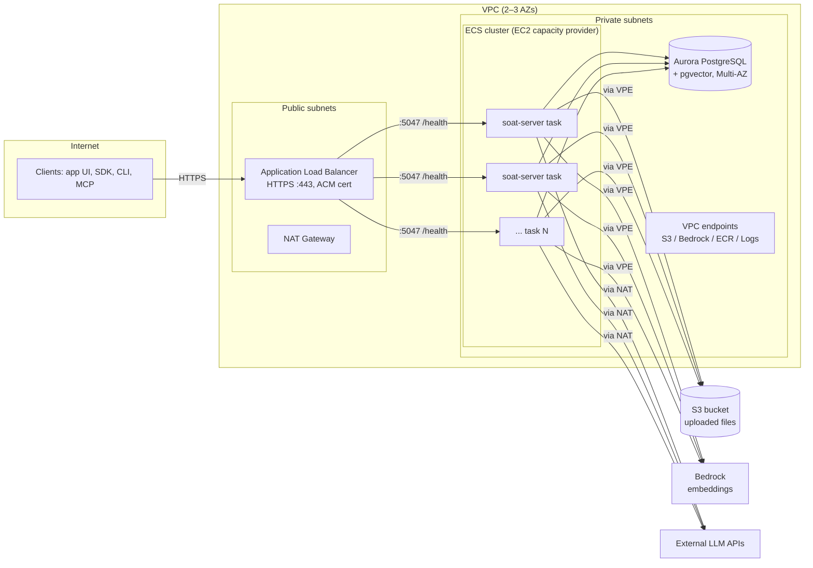

# AWS Infrastructure Design — Running SOAT at Scale

This document describes the target AWS architecture for running the SOAT server
at production scale: an ECS cluster on EC2 capacity behind an Application Load
Balancer, Aurora PostgreSQL with pgvector, S3 for file storage, and Bedrock for
embeddings. It is grounded in the actual runtime behavior of the codebase
(single stateless container, DB-lease-based schedulers, JWT auth) and calls out
the two code changes required before the design can be fully realized.

## 1. Application Facts That Drive the Design

These were verified in the codebase and are the constraints the infrastructure
is built around:

| Fact | Source | Infrastructure consequence |
| --- | --- | --- |
| Single Node.js process serves REST API, `/app` UI, and MCP endpoint on port `5047` | `Dockerfile` (production stage) | One container image, one ECS service, one target group |
| Auth is JWT-based (`JWT_SECRET`), no server-side session state | `packages/server/src` | No sticky sessions at the load balancer; any task can serve any request |
| Trigger and orchestration schedulers use atomic DB claims and lease expiry | `src/lib/triggerScheduler.ts`, `src/lib/orchestrationScheduler.ts` | Multiple replicas are safe; scheduled work fires exactly once without a dedicated scheduler node |
| Uploaded files are written to local disk (`FILES_STORAGE_DIR=/data/files`) | `Dockerfile`, `src/lib/files.ts` | **Blocker for >1 replica** — must move to shared storage (S3, see §6) |
| Embeddings support only Ollama (`EMBEDDING_PROVIDER=ollama`) | `src/lib/embedding.ts` | Hosted embeddings require a small provider extension (see §7) |
| Schema is synced at boot via `sequelize.sync({ alter: true })` | `src/server.ts` | Concurrent replica startups can race on DDL — deploys must serialize schema sync (see §9) |
| Requires PostgreSQL with the `pgvector` extension (dev uses `pgvector 0.8.2` on PG18) | `packages/server/docker-compose.db.yml` | Managed Postgres engine version must support pgvector; verify version at build time |
| Agent generations and MCP streaming are long-lived HTTP requests (LLM calls) | agents/sessions modules | ALB idle timeout must be raised well above the 60s default |
| Outbound calls to external LLM providers (OpenAI, etc.) | ai-providers module | Private subnets need NAT (or VPC endpoints for Bedrock) |

## 2. Architecture Overview



Component summary:

| Component | Choice | Alternative noted |
| --- | --- | --- |
| Compute | ECS cluster, **EC2 capacity provider** (Bottlerocket AMI) | Fargate; ECS Managed Instances |
| Routing | ALB, HTTPS via ACM, Route53 | CloudFront + WAF in front (optional) |
| Database | **Aurora PostgreSQL** with pgvector | RDS PostgreSQL Multi-AZ (cheaper) |
| File storage | **S3** (requires code change) | EFS as interim, zero-code option |
| Embeddings | **Bedrock** (requires code change) | Self-hosted Ollama on GPU EC2 |
| Secrets | AWS Secrets Manager → task definition | SSM Parameter Store (SecureString) |
| Observability | CloudWatch Logs + Container Insights + alarms | — |
| IaC | **Terraform** | CloudFormation |
| CI/CD | GitHub Actions → ECR → ECS rolling deploy | — |

## 3. Networking

- **VPC** spanning 2 AZs minimum (3 for higher availability), with:
  - **Public subnets**: ALB and NAT gateway(s).
  - **Private subnets**: ECS container instances, Aurora, VPC endpoints.
- **NAT gateway** for outbound traffic from tasks to external LLM provider APIs
  (OpenAI, Anthropic, etc.). One NAT per AZ for HA; a single NAT is an
  acceptable cost saving at small scale (cross-AZ data charge + AZ risk).
- **VPC endpoints** (interface/gateway) for `s3`, `bedrock-runtime`, `ecr.api`,
  `ecr.dkr`, `logs`, and `secretsmanager` — keeps high-volume internal traffic
  off the NAT gateway (cost) and inside AWS (security).
- **Security groups** (least privilege):
  - ALB SG: inbound `443` from the internet (or from CloudFront prefix list).
  - Service SG: inbound `5047` from ALB SG only.
  - DB SG: inbound `5432` from the service SG only.
- **DNS/TLS**: Route53 record → ALB; certificate from ACM with auto-renewal.
- **Optional hardening**: AWS WAF on the ALB (rate limiting, common rule
  sets); CloudFront in front for TLS termination at edge and static asset
  caching of the `/app` bundle.
- **Cost note**: private subnets + NAT + interface endpoints are the
  standard-tier posture. The budget tier (§14) legitimately runs tasks in
  public subnets with strict security groups (inbound from the ALB only)
  and no NAT — equally secure in practice at small scale, ~$70/month less.

## 4. Compute — ECS Cluster on EC2 Capacity

One ECS cluster with an **EC2 capacity provider** backed by an Auto Scaling
Group.

### Container instances

- **AMI**: [Bottlerocket](https://aws.amazon.com/bottlerocket/) (ECS variant) —
  minimal, container-only OS with atomic in-place updates. This significantly
  reduces the patching burden that comes with owning EC2 hosts.
- **Instance type**: start with `m6i.large` / `m7g.large` (2 vCPU, 8 GiB) × 2,
  one per AZ. The server is memory-modest (`NODE_OPTIONS=--max-old-space-size`
  is set to 768 MB in the smoke environment; give production tasks 1–2 GiB).
- **ASG + capacity provider** with managed scaling and managed instance
  draining: ECS scales the instance fleet to fit the task count, and drains
  tasks off instances before scale-in/refresh.
- **Instance refresh** pipeline for AMI updates (Bottlerocket releases):
  rolling replacement through the ASG, relying on managed draining.

### ECS service — `soat-server`

- Task definition: the existing production image (see §10), `PORT=5047`,
  `awsvpc` network mode, secrets injected from Secrets Manager (§8).
- **Desired count ≥ 2**, spread across AZs
  (`attribute:ecs.availability-zone` spread placement strategy).
- **Task auto scaling** (Application Auto Scaling):
  - Target tracking on `ALBRequestCountPerTarget` (primary signal), plus
    CPU ~60% as a backstop.
  - The capacity provider scales instances to follow tasks automatically.
- **Task sizing**: 0.5–1 vCPU, 1–2 GiB per task to start; adjust
  `--max-old-space-size` to match the memory reservation.
- Deployment: rolling update, `minimumHealthyPercent=100`,
  `maximumPercent=200`, with **circuit breaker + rollback** enabled. See §9
  for the schema-sync ordering constraint.

### Why EC2 capacity (and when to reconsider)

Chosen for cost control at sustained scale (Savings Plans / RIs, dense task
packing) and because it keeps the door open for GPU instances in the same
cluster if self-hosted Ollama is ever added. The trade-off accepted: owning
the instance lifecycle (mitigated by Bottlerocket + managed draining +
instance refresh).

Alternatives, for the record:

- **Fargate** — zero host management, per-task billing, fastest to operate.
  Better at small or spiky scale; ~20–40% higher unit compute cost and no GPU
  support. The service definition is capacity-provider-agnostic, so moving
  between Fargate and EC2 later is a configuration change, not a
  re-architecture.
- **ECS Managed Instances** — EC2-backed capacity whose instance lifecycle
  (patching, replacement) is managed by AWS for a management fee, including
  GPU instance types. Worth pricing out as the middle path; if the fee is
  acceptable it removes most of the day-2 burden of the EC2 launch type.

## 5. Load Balancer

- **ALB** in the public subnets, HTTPS listener (`443`) with the ACM
  certificate; HTTP (`80`) listener that redirects to HTTPS.
- Target group → ECS service on port `5047`, target type `ip` (awsvpc).
- **Health check**: `GET /health`, healthy threshold 2, interval 15s. This is
  the same endpoint the compose healthcheck uses.
- **Idle timeout: 600s** (default is 60s). Agent generation endpoints and MCP
  streaming hold connections open for the duration of LLM calls and tool
  orchestration; 60s will sever long generations. Clients should still
  implement retry/poll behavior, but the LB must not be the thing that cuts
  the connection.
- Deregistration delay ~60s so in-flight generations can finish during
  deploys (long-running generations that exceed this will be cut on task
  replacement; the orchestration lease/reaper design recovers runs, and
  generation polling endpoints recover clients).
- `SOAT_BASE_URL` must be set to the public URL (e.g.
  `https://soat.example.com`) — the server uses it to build presigned upload
  URLs and trigger callbacks.

## 6. Database — Aurora PostgreSQL with pgvector

**Primary choice: Aurora PostgreSQL.**

- **pgvector** is available as a standard extension on Aurora PostgreSQL
  (`CREATE EXTENSION vector;`). ⚠️ Version note: local dev runs
  `pgvector 0.8.2 on PostgreSQL 18`. Confirm at build time which Aurora
  engine version carries a compatible pgvector release; if the required
  pgvector/PG version is not yet available on Aurora, pin local dev down to
  the Aurora-supported version rather than self-hosting — the codebase does
  not depend on PG18-specific features.
- **Topology**: one writer + one reader in a different AZ (the reader doubles
  as the failover target; failover is typically <30s). The app has no
  read/write split today, so the reader is for HA, not load — reader
  endpoints can be adopted later without infra changes.
- **Serverless v2 vs provisioned**: start with **Aurora Serverless v2**
  (e.g. 0.5–8 ACUs) if load is unproven or spiky; move to provisioned
  (`db.r6g.large`+) once the baseline is steady — provisioned is cheaper at
  constant load.
- Storage auto-scales; no volume management.
- **Backups**: automated backups with 7–35 day retention + deletion
  protection enabled.
- Credentials in Secrets Manager with rotation enabled.
- **Connection pooling**: Sequelize pools per task. Cap
  `pool.max × max task count` below the Aurora `max_connections` for the
  instance class. If task count grows large, put **RDS Proxy** between the
  service and the cluster rather than raising `max_connections`.

**Cheaper alternative**: RDS for PostgreSQL, Multi-AZ, `db.t4g.medium`+ —
also fully managed with pgvector, roughly half the cost, but slower failover,
no storage autoscaling to the same degree, and no serverless option.

**Rejected**: self-managed PostgreSQL on EC2. Full control over PG/pgvector
versions does not outweigh owning backups, WAL archiving, failover
orchestration, patching, and disk management. Only revisit if a bleeding-edge
pgvector feature becomes a hard requirement before AWS ships it.

## 7. File Storage — S3 (decision) and Embeddings — Bedrock (recommendation)

Both are **code-dependent**: today files go to local disk and only Ollama is
supported for embeddings. Infrastructure below assumes the code changes in
§11 land first.

### S3 for uploaded files

- One private bucket, e.g. `soat-files-<env>-<account>`:
  - Block Public Access: all four settings on.
  - Default encryption SSE-S3 (or SSE-KMS if key-level auditing is needed).
  - Versioning on (cheap protection against accidental delete/overwrite).
  - Lifecycle rule: abort incomplete multipart uploads after 7 days;
    optionally transition old objects to Intelligent-Tiering.
- Task role IAM: `s3:GetObject`, `s3:PutObject`, `s3:DeleteObject` scoped to
  the bucket ARN — no bucket-wide `s3:*`.
- Access via the **S3 gateway VPC endpoint** (free, no NAT traversal).
- The server's existing presigned-upload flow
  (`POST /files/presigned-url`, `upload-file-with-token`) can either keep the
  server as the byte-proxy (S3 behind it) or be upgraded to true S3 presigned
  URLs later so upload bytes bypass the service entirely — the first is the
  minimal change, the second is the scalability endgame for large files.

**Interim option if scaling is needed before the S3 backend lands**: mount
EFS at `/data/files` on all tasks. Zero code changes (the
`FILES_STORAGE_DIR` implementation works unmodified), one Terraform module,
and it can be dropped once S3 support ships.

### Bedrock for embeddings (long-term recommendation)

- **Why hosted**: a single always-on GPU instance for Ollama (g5.xlarge)
  costs ≈ $730/month before HA — that budget buys billions of embedded
  tokens from a hosted model. Hosted also scales elastically with ingestion
  bursts and keeps the cluster uniform (no GPU capacity provider, no driver
  patching).
- **Why Bedrock specifically**: traffic stays inside AWS via the
  `bedrock-runtime` VPC endpoint, auth is the task IAM role (no API key to
  store/rotate), and Titan Text Embeddings v2 / Cohere Embed are stable,
  mainstream models.
- **The one real long-term risk of hosted is model deprecation**: pgvector
  columns are dimensioned by `EMBEDDING_DIMENSIONS`, so any model change —
  a hosted deprecation *or* a self-hosted model swap — forces re-embedding
  every document. Mitigation: pick a major model, record
  provider/model/dimensions alongside the deployment, and treat "re-embed
  all documents" as a supported operational procedure rather than an
  emergency.
- Config once supported: `EMBEDDING_PROVIDER=bedrock`,
  `EMBEDDING_MODEL=amazon.titan-embed-text-v2:0`,
  `EMBEDDING_DIMENSIONS=1024` (Titan v2 supports 256/512/1024).

**Alternative — self-hosted Ollama** (works with today's code): a second ECS
service on a GPU capacity provider (`g5`/`g6` ASG), internal service
discovery, `OLLAMA_BASE_URL` pointing at it, model baked into the image or
pulled at boot onto an EBS volume. Choose this only for strict
data-sovereignty requirements or extremely high sustained embedding volume —
and note the sovereignty argument is weakened by SOAT already calling
external LLM APIs for generation.

## 8. Secrets and Configuration

Secrets go to **AWS Secrets Manager** and are injected via the task
definition's `secrets` block (never plaintext `environment` entries):

| Secret | Notes |
| --- | --- |
| `DATABASE_PASSWORD` (or full connection secret) | Managed by RDS/Aurora, rotation enabled |
| `JWT_SECRET` | Long random value; rotating it invalidates all sessions — plan rotations |
| `SECRETS_ENCRYPTION_KEY` | 64-char hex (32 bytes). **Encrypts the SOAT secrets module at rest — losing it makes stored secrets unrecoverable, changing it breaks decryption of existing rows. Back it up; never rotate casually.** |
| `SOAT_ADMIN_PASSWORD` | Only if bootstrap-on-boot is used |

Non-secret configuration as plain environment variables in the task
definition:

| Variable | Value |
| --- | --- |
| `PORT` | `5047` |
| `SOAT_BASE_URL` | Public HTTPS URL |
| `DATABASE_HOST` / `DATABASE_PORT` / `DATABASE_NAME` / `DATABASE_USER` | Aurora endpoint |
| `EMBEDDING_PROVIDER` / `EMBEDDING_MODEL` / `EMBEDDING_DIMENSIONS` | Per §7 |
| `NODE_OPTIONS` | `--max-old-space-size` matched to task memory |
| `FILES_STORAGE_DIR` | Only while on local/EFS storage; superseded by S3 config |
| Tuning (optional) | `ORCHESTRATION_RUN_LEASE_TTL_MS`, `INGESTION_STALL_TIMEOUT_MS`, `CONVERSION_STALL_TIMEOUT_MS`, `SYNC_INGESTION_MAX_BYTES`, `SOAT_TOOL_CALL_TIMEOUT_MS`, `SOAT_TRIGGER_TOKEN_TTL` |

Two IAM roles per service, kept distinct:

- **Task execution role** — ECR pull, CloudWatch Logs, Secrets Manager read
  (used by ECS itself).
- **Task role** — S3 object access, `bedrock:InvokeModel` (used by the app).

## 9. Deployments and the Schema-Sync Constraint

`server.ts` runs `sequelize.sync({ alter: true })` on every boot. Two or more
replicas starting simultaneously can race on `ALTER TABLE` statements
(deadlocks, duplicate-object errors).

**Deployment procedure to serialize DDL:**

1. CI builds and pushes the image to ECR (the `publish-docker` job in
   `main.yml` already builds this image for Docker Hub; add an ECR push).
2. **Run a one-off ECS task (`aws ecs run-task`) with the new image first** —
   same task definition, command overridden to run the schema sync and exit
   (or simply boot-and-health-check a single task). This applies DDL exactly
   once.
3. Then update the service; rolling replacement starts tasks whose
   `sync({ alter: true })` is a no-op.

**Recommended code hardening (small, not required on day one)**: gate the
sync behind an env var (e.g. `DB_SYNC=off` on service tasks, `on` only for
the migration task), and longer-term replace `alter: true` with explicit
migrations (e.g. Umzug) — `--alter` on a production schema can generate
destructive DDL. Until then, the run-task step plus
`minimumHealthyPercent=100` keeps deploys safe in practice.

## 10. CI/CD

Extend the existing GitHub Actions release flow (`main.yml`):

```
release PR merged → push-release-tag → release (npm + website)
                                    → publish-docker (Docker Hub)
                                    → deploy-aws  (new)
```

`deploy-aws` job:

1. Build (or retag) the production image; push to **ECR** with the release
   version and `latest` tags.
2. Run the schema-sync one-off task (§9).
3. `aws ecs update-service --force-new-deployment` with the new task
   definition revision; wait for `services-stable`.
4. Auth via **GitHub OIDC → IAM role** (no long-lived AWS keys in GitHub
   secrets).

Rollback = redeploy the previous image tag (schema is forward-synced only;
`alter` does not drop columns by default, so N−1 images run against an N
schema).

## 11. Required Code Changes (prerequisites from this design)

Tracked here so the infra plan is honest about its dependencies — each should
go through the normal module checklist (lib + tests + docs):

1. **S3 storage backend for files** (`packages/server/src/lib/files.ts` and
   related): abstract the disk read/write behind a storage interface with
   `local` and `s3` drivers selected by env (e.g. `FILES_STORAGE_DRIVER=s3`,
   `FILES_S3_BUCKET=...`). Until this lands, horizontal scaling requires the
   EFS interim (§7).
2. **Hosted embedding provider** (`packages/server/src/lib/embedding.ts`):
   add a `bedrock` (or OpenAI-compatible) branch next to the existing
   `ollama` branch. ~30 lines with the AWS SDK v3
   `BedrockRuntimeClient`.
3. *(Optional hardening)* `DB_SYNC` env gate around
   `sequelize.sync({ alter: true })` (§9).

## 12. Observability

- **Logs**: `awslogs` driver → CloudWatch Logs, one log group per service,
  30–90 day retention. `DEBUG=soat:*` can be enabled per-deployment via env
  var for verbose diagnosis.
- **Metrics**: Container Insights on the cluster (task/instance CPU, memory);
  ALB metrics (`RequestCount`, `TargetResponseTime`, `HTTPCode_Target_5XX`);
  Aurora metrics + **Performance Insights** (query-level visibility —
  pgvector similarity queries are the ones to watch as document volume
  grows).
- **Alarms** (SNS → email/Slack):
  - ALB 5xx rate and target response time p99.
  - ECS service running count < desired count.
  - Aurora: CPU, freeable memory, `DatabaseConnections` approaching the cap,
    replica lag.
  - NAT gateway data processing (cost anomaly signal).
- **Health**: the ALB health check on `/health` is the liveness source of
  truth; the ECS circuit breaker rolls back deployments whose tasks fail it.

## 13. Terraform Layout

Terraform chosen over CloudFormation: richer community modules (VPC, ALB,
ECS, RDS), `plan` previews before apply, and less verbose configuration.
CloudFormation remains viable if a zero-third-party-tooling policy exists.

```
infra/
├── modules/
│   ├── network/      # VPC, subnets, NAT, VPC endpoints, SGs
│   ├── alb/          # ALB, listeners, target group, ACM cert
│   ├── ecs-cluster/  # cluster, ASG, capacity provider (Bottlerocket)
│   ├── soat-service/ # task definition, service, autoscaling, IAM roles
│   ├── database/     # Aurora cluster, subnet group, secrets, RDS proxy (opt)
│   └── storage/      # S3 bucket (+ interim EFS module while needed)
└── envs/
    ├── staging/      # small: 1 NAT, Serverless v2 min ACU, 2 tasks
    └── production/   # per this document
```

State in S3 + DynamoDB locking. Community modules
(`terraform-aws-modules/vpc`, `/ecs`, `/rds-aurora`, `/alb`) cover most of
this directly.

## 14. Sizing and Rough Monthly Cost (us-east-1, on-demand, order of magnitude)

Three tiers. The difference between them is almost entirely **how much
high availability you pay for** — the architecture (ECS + ALB + Postgres +
S3) is the same shape in all three, so moving up a tier is resizing, not
re-architecting.

### Budget tier — single-AZ, no redundancy (~$50–90)

For a launch with low traffic where a short outage is acceptable.

| Item | Size | ~USD/month | HA sacrificed |
| --- | --- | --- | --- |
| EC2 container instance | 1 × t4g.medium (2 vCPU, 4 GiB) | ~25 | Instance failure = downtime until ASG replaces it (minutes) |
| RDS PostgreSQL | db.t4g.micro, single-AZ, 20 GB gp3 | ~14 | AZ/instance failure = restore from backup (minutes–hours) |
| ALB | 1 | ~25 | — (kept: TLS, health checks, zero-downtime deploys) |
| NAT gateway | **none** — tasks in public subnets with public IPs, SG locked to ALB-only inbound | 0 | None; equally secure if SGs are strict |
| Interface VPC endpoints | **none** — traffic egresses via public IPs | 0 | None at this scale |
| S3, Secrets Manager, CloudWatch | minimal | ~5 | — |
| **Total** | | **~$70** | |

Notes: Graviton (`t4g`) is ~20% cheaper than x86 and the image is plain
Node — build the image multi-arch. Burstable instances fit the workload
(the server idles between LLM calls). Dropping the ALB too (Elastic IP +
host-level TLS) saves another $25 but gives up health-checked rolling
deploys — not recommended.

### Standard tier — multi-AZ HA (~$300–600, the original estimate)

What §§3–6 describe: 2 × m6i.large across AZs (~$140), Aurora Serverless
v2 writer + reader (~$90–350 — the 0.5 ACU floor alone is ~$44/instance
24/7), ALB (~$25), NAT gateway (~$35), endpoints/secrets/logs (~$20–50).
The premium over the budget tier buys: no single point of failure,
<30s DB failover, and private-subnet isolation.

### The middle path (~$120–180)

Budget tier plus the two cheapest HA upgrades: second t4g instance in a
second AZ (+$25) and RDS Multi-AZ on db.t4g.small (~$47 total for the
pair). Keeps: no NAT (public subnets), no Aurora, no endpoints.

### Levers as scale grows

Compute Savings Plans on the EC2 fleet (the main reason EC2 capacity was
chosen), provisioned Aurora only once load justifies it, NAT-per-AZ only
when the availability requirement justifies it, RDS Proxy when task count
× pool size approaches connection limits. A `fck-nat` instance
(t4g.nano, ~$3/mo) is a community-standard NAT replacement if private
subnets are wanted without the $35 managed NAT.

## 15. Phased Rollout

1. **Phase 0 — lift**: Terraform network + cluster + Aurora; single task,
   EFS at `/data/files`, Ollama replaced by nothing (embeddings unconfigured
   → knowledge search returns `EMBEDDING_NOT_CONFIGURED` until Phase 2 if
   acceptable, or keep a small Ollama task temporarily).
2. **Phase 1 — scale out**: ship the S3 storage driver, drop EFS, raise
   desired count to 2+, enable task auto scaling.
3. **Phase 2 — embeddings**: ship the Bedrock provider branch, configure
   Titan v2, re-ingest/embed documents.
4. **Phase 3 — hardening**: WAF, RDS Proxy if needed, migrations instead of
   `sync --alter`, NAT-per-AZ, Savings Plans.
