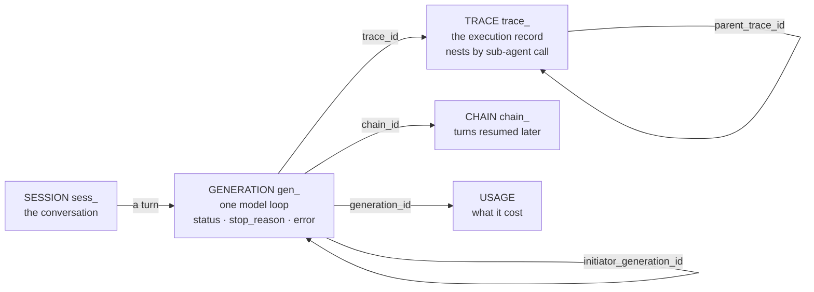

# Debugging a Run

SOAT records what happened on several surfaces, and each one is documented on its own module page. That leaves one question unanswered until you have read all of them: **you are holding a symptom — which surface do you open?**

This page is that map. It routes a symptom to a surface, draws the id graph the surfaces are joined on, and names the cases where a surface is empty by design rather than broken.

For what each surface *is*, follow the links. For the field-level contrast between the three that are most easily confused — activity, the audit log and traces — see [Activity vs. the audit log vs. traces](../modules/activity.md#activity-vs-the-audit-log-vs-traces); this page does not repeat it.

## Start from the symptom

| Symptom | Surface | Open it with |
| --- | --- | --- |
| The call came back an error | the error body, then the [generation](../modules/generations.md) | A failed `wait=true` run answers `GENERATION_FAILED`, whose `meta` carries `generation_id` and `trace_id` — the thread to pull |
| It answered `202` and nothing came back | the [generation](../modules/generations.md)'s `status` | [`GET /generations/{generation_id}`](/docs/api/generations/get-generation) — `in_progress`, `requires_action`, `completed` or `failed` |
| It finished, but the answer was wrong | the [transcript](../modules/generations.md#transcript) | [`GET /generations/{generation_id}/transcript`](/docs/api/generations/get-generation-transcript) — the turn read back step by step |
| It stopped early, or mid-sentence | `stop_reason` on the generation | The [Stop Reason](../modules/agents.md#stop-reason) table — `max_steps`, `depth_guard`, `chain_limit` and `length` are four different bugs |
| A multi-agent run broke, and you don't know where | the [trace](../modules/traces.md) tree | [`GET /traces/{trace_id}/tree`](/docs/api/traces/get-trace-tree) from any trace in the run — the node carrying an `error` is the one that failed |
| The agent said it queued something, and nothing happened | the [chain](../modules/chains.md) | [`GET /chains/{chain_id}`](/docs/api/chains/get-chain) — `expired` means an [approval](../modules/approvals.md) lapsed and nothing resumed the work |
| A run failed after exhausting its retries | the [exceptions](../modules/exceptions.md) queue | [`GET /exceptions`](/docs/api/exceptions/list-exceptions) — filed for [orchestration runs](../modules/orchestrations.md), tripwires, expired approvals and chain limits |
| A tool call never ran | the [exception](../modules/exceptions.md)'s `guardrail_version` | A `guardrail_tripwire` item names the exact [guardrail](../modules/guardrails.md) document that stopped it |
| It cost more than you expected | [usage](../modules/usage.md) events | Attribution runs to the project, agent, generation and `action_id`, so spend is grouped by the operation that caused it |
| Something changed and nobody says who | the [audit log](../modules/audit-log.md) | The recorded `action` **is** the permission string that authorized it, and `403`s are recorded too |
| "What have the agents been doing?" | the [activity](../modules/activity.md) feed | One entry per autonomous execution — tool calls, schedule firings, approvals resolved |

The first four rows are one investigation, in order: the error names the ids, the generation says how it ended, `stop_reason` says why, and the transcript says what it did. Most debugging never leaves them.

## The id graph

Every surface above is reached from a generation, which is why a generation id is the one thing worth capturing at your own boundary.

Three of these are one call rather than a walk:

- **The whole tree from any node.** [`GET /traces/{trace_id}/tree`](/docs/api/traces/get-trace-tree) resolves the root itself, so the id you happen to be holding is enough — no climb up `parent_trace_id`. Add `include=generations` to get each node's generations with it.
- **Every turn of one run.** [`GET /generations?trace_id=`](/docs/api/generations/list-generations) returns all generations on a trace; `chain_id`, `orchestration_run_id` and `node_id` slice the same list other ways.
- **A run's work from its orchestration.** A node execution record carries no generation id — the pointer runs the other way, from the generation's attribution columns. See [Finding an orchestration run's generations](../modules/generations.md#finding-an-orchestration-runs-generations).

**The one join SOAT does not keep is `session_id`.** A trace record has no session field, so correlating a customer complaint back to a run means capturing `(session_id, generation_id, trace_id)` at your own boundary when the generation is created. Do it on day one; it cannot be reconstructed later. [Debug Session, Generation, and Trace History](../tutorials/debug-session-generation-trace-history.md) walks the full mapping.

## When a surface is empty

An empty answer is information, and it has four different meanings. Reading it as "the platform lost my data" sends you looking in the wrong place.

| What you see | What it means |
| --- | --- |
| `steps: []`, `status: in_progress` | The turn has not finished. Poll it. |
| `steps: []`, `status: failed` | The turn **threw**. A step is recorded when it finishes, and an aborted turn finishes none — so a run that died inside a tool call has no steps to show. The `error` on the generation is the whole story, and the [trace carries the same payload](../modules/traces.md#generation-failures). |
| `steps: []` with `content_redacted_at` set | The content is gone — or was never written. `content_redacted_by_principal_id` is `zero_retention` when it was never stored, and the erasing principal's id when a [purge](../modules/traces.md#content-purge) or the [retention sweep](../modules/traces.md#retention-policy) removed it. |
| An empty [exceptions](../modules/exceptions.md) queue | Quite possibly the wrong surface — see below. |

### Two things that are not where you would look for them

**A failed agent generation files no exception.** Every [`kind`](../modules/exceptions.md#severity) names a specific producer — an [orchestration run](../modules/orchestrations.md) that died after exhausting retries, a [guardrail](../modules/guardrails.md) tripwire, an [approval](../modules/approvals.md) that expired undecided, a [chain](../modules/chains.md) that spent its budget, a self-feeding [event trigger](../modules/triggers.md#loops-and-cost), a [cost cap with no prices](../modules/quotas.md#token-and-cost-enforcement), or a `manual` filing. A plain [`POST /agents/{agent_id}/generate`](/docs/api/agents/create-agent-generation) that failed is none of them. An empty queue is therefore not evidence that agent runs are healthy — [`GET /generations?status=failed`](/docs/api/generations/list-generations) is the worklist for those.

**An approval-gated tool call does not leave the generation pending.** The intercepted call returns `{ "status": "pending_approval" }` as the *tool result* and the turn **completes** normally — the model closes with something like "queued for your approval". The real work happens later, in a [continuation generation](../modules/approvals.md#how-producers-suspend-and-resume) linked back through `initiator_generation_id`. So "it said it queued the refund and nothing happened" is diagnosed on the [chain](../modules/chains.md), not on the generation you are looking at, and `expired` there means nobody decided in time.

## What you can debug is a configuration choice

The observability above is not a constant. [Zero-retention mode](../modules/traces.md#zero-retention-mode) never writes the steps object — and it does not write the generation's `error` either, because that is content by the same definition. A project on `trace_content_mode: none` keeps every skeleton field (ids, `status`, `stop_reason`, `step_count`, and the whole usage ledger), so metering, quotas and the audit log are untouched; what it gives up is precisely the material this page tells you to read.

That is a legitimate trade, and it is worth making deliberately rather than discovering mid-incident:

| Setting | You keep | You give up |
| --- | --- | --- |
| Default (`full`) | Everything on this page | Content lives until you purge it |
| [Retention window](../modules/traces.md#retention-policy) | Full debugging inside the window | Anything older than the window, swept daily |
| [Zero-retention](../modules/traces.md#zero-retention-mode) | Status, stop reason, step count, cost | Steps, errors, and restart-recovery of a paused turn |

[Data Retention and Zero-Retention](../tutorials/data-retention-and-zero-retention.md) walks all three end to end.

## Next

- [Debug Session, Generation, and Trace History](../tutorials/debug-session-generation-trace-history.md) — the id mapping as a runnable walkthrough.
- [Replay a Bad Turn](../tutorials/replay-a-bad-turn.md) — what to do once the transcript shows a bad answer: freeze it as a fixture, fork the session, and re-run the same context.
