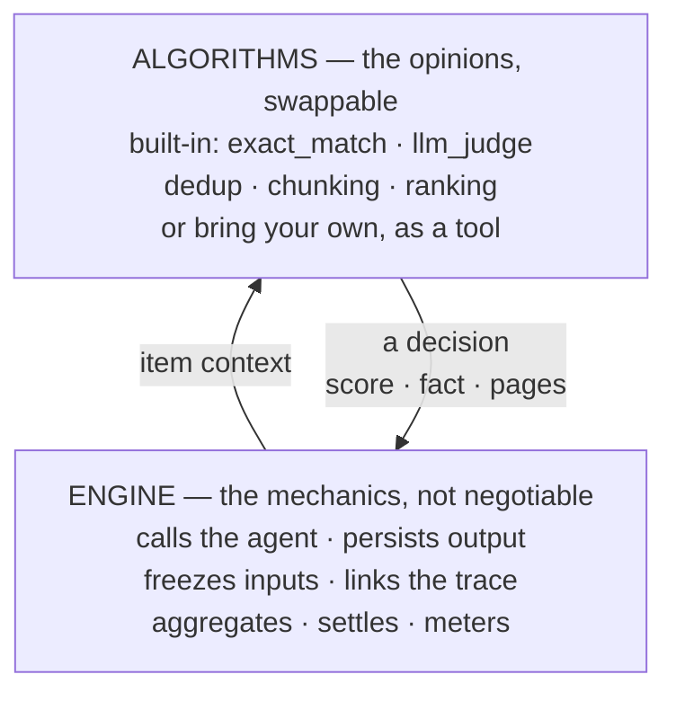

# Engines & Algorithms

Every intelligence module — [Evaluations](/docs/modules/evaluations),
[Memories](/docs/modules/memories), [Knowledge](/docs/modules/knowledge) — splits into the
same two layers: what you can rely on, what you may disagree with, and where your own code
plugs in.

The engine hands an algorithm the context, the algorithm hands back a decision, and the
engine records it under guarantees that do not depend on which algorithm answered. Built-in
and custom algorithms fill the same slot.

## The pattern

### The engine — mechanics you cannot opt out of

The engine calls the agent, calls the model, persists the output, freezes the inputs, links
the trace, settles the run. Permissions, metering, retention, and observability ride on it;
its guarantees (a run settles, a write is never lost, an error is never a score) hold no
matter what runs on top. It is not replaceable and holds no opinion about your application.

### Algorithms — opinions that run on the engine

Algorithms decide: what "good output" means (a
[scorer](/docs/modules/evaluations#scorers)), what is worth remembering (the
[extraction algorithm](/docs/modules/memories#automatic-extraction)), whether two facts
are the same fact (the [write algorithm](/docs/modules/memories#write-algorithm)), where
a document splits
([chunking](/docs/advanced/memory-and-knowledge-engine#chunking-algorithms)), which
result ranks first
([retrieval](/docs/advanced/memory-and-knowledge-engine#the-retrieval-algorithm)). Each
is named, has a default, and usually has a knob.

### Custom algorithms — bring your own as a tool

When no built-in algorithm fits, the extension mechanism is a
[Tool](/docs/modules/tools). At a documented seam, the engine invokes your tool with a
fixed input contract; your code (any language, model, vendor, wherever you run it) answers
in the documented output shape; the engine records the result under the same invariants as
a built-in algorithm.

Tools are the seam because they already carry what a production algorithm needs:

- **Project-scoped and reusable** — one tool, shared across agents, evals, and rules.
- **Credentialed safely** — API keys live in [Secrets](/docs/modules/secrets) references,
  never in configs.
- **Server-callable** — `http`, `mcp`, `builtin`, and `pipeline` tools all work, through the
  same invocation path agents use. `client` tools are refused at these seams: they pause
  for a calling client, and an engine runs server-side.
- **Governed** — project-scoped, traceable, subject to the same platform controls as every
  other tool call.

## The three engines

| Module | The engine (mechanics) | Built-in algorithms | Bring your own |
| --- | --- | --- | --- |
| [Evaluations](/docs/modules/evaluations) | Datasets, runs, frozen inputs, version pinning, aggregation, baselines, queueing, lifecycle webhooks | The [scorers](/docs/modules/evaluations#scorers): `exact_match`, `contains`, `json_logic`, `output_schema`, `llm_judge` | A [custom scorer](/docs/modules/evaluations#custom-scorers-tool) — a `tool` scorer graded by your own algorithm |
| [Memories](/docs/modules/memories) (write side) | One write funnel, embedding, provenance, temporal invalidation | The [write (dedup/merge) algorithm](/docs/modules/memories#write-algorithm) and [fact extraction](/docs/modules/memories#automatic-extraction) | A custom extraction `prompt`/model; per-write `duplicate_threshold` tuning — see the [engine deep dive](/docs/advanced/memory-and-knowledge-engine#extending-the-engine-today) |
| [Knowledge](/docs/modules/knowledge) (read side) | Two stores, one search function, injection into generations | [Chunking strategies](/docs/advanced/memory-and-knowledge-engine#chunking-algorithms), [retrieval ranking](/docs/advanced/memory-and-knowledge-engine#the-retrieval-algorithm) | A [converter tool](/docs/modules/ingestion-rules#converter-tool-contract) via ingestion rules — your OCR, transcription, or parser; pre-chunking and re-ranking [composition](/docs/advanced/memory-and-knowledge-engine#extending-the-engine-today) |

Each module page separates engine behavior from algorithm behavior, and every
bring-your-own seam documents its exact input and output contract.

## What holds no matter which algorithm runs

- **Your algorithm failing never corrupts a verdict.** A scorer tool that errors or
  answers garbage marks the *item* errored — never a score of 0, never a failed run
  ([errors are not zeros](/docs/modules/evaluations#errors-are-not-zeros)). A converter
  that fails marks the *document* failed with a named
  [`failure_reason`](/docs/modules/ingestion-rules#failure-reasons). An extraction that
  fails is skipped; the turn it came from is unaffected.
- **Contracts are wire contracts.** Every seam speaks snake_case JSON in and out, the same
  convention as the REST API, so your tool is an ordinary endpoint, testable with `curl`.
- **Authorization does not widen.** The engine invokes your tool scoped to the owning
  project; a scorer or converter never borrows another project's tools or secrets.
- **Observability is uniform.** Runs, documents, and generations record what the
  algorithm decided (scores and reasoning, extraction summaries, failure reasons).

## Where to go next

- Grade agents with your own metric: [Custom scorers](/docs/modules/evaluations#custom-scorers-tool).
- Teach ingestion a new file type: [Ingestion Rules](/docs/modules/ingestion-rules).
- One engine end to end, with every algorithm and seam:
  [Memory & Knowledge Engine](/docs/advanced/memory-and-knowledge-engine).
