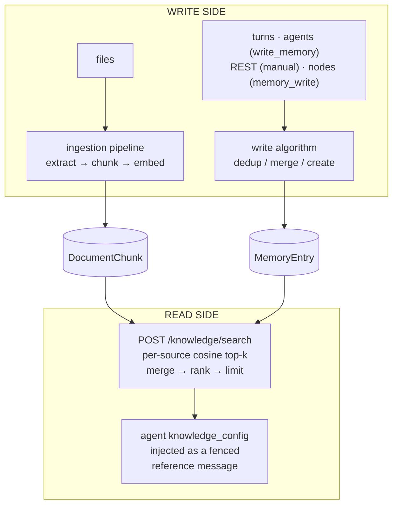

# Memory & Knowledge Engine

One engine, two sides: the **write side** turns conversations, agent decisions, and uploaded files into stored, embedded knowledge; the **read side** turns a query into ranked results and injects them into generations. Engine-side deep dive of the [engine & algorithms pattern](./engines-and-algorithms.md); caller-facing contracts: [Memories](../modules/memories.md), [Knowledge](../modules/knowledge.md), [Documents](../modules/documents.md), [Embeddings](../modules/embeddings.md), [Ingestion Rules](../modules/ingestion-rules.md). Tutorials: [Agent with Persistent Memory](/docs/tutorials/memories-agent), [Agent over a Library of PDFs](/docs/tutorials/agent-with-pdfs).

## The engine at a glance

No separate vector database, no "knowledge base" resource. Knowledge lives in **two stores** (document chunks and memory entries, PostgreSQL rows with pgvector embedding columns) unified **at query time** by one search function:



| Stage | Algorithm today | Configured by |
| --- | --- | --- |
| Content extraction | Native extractors (PDF, text, markdown) or a converter you provide | [Ingestion rules](../modules/ingestion-rules.md) |
| Chunking | `page` \| `whole` \| `size` (character window + overlap) | `chunk_strategy`, `chunk_size`, `chunk_overlap` |
| Embedding | One deployment-wide model | `EMBEDDING_PROVIDER`, `EMBEDDING_MODEL`, `EMBEDDING_DIMENSIONS` |
| Memory write decision | Cosine dedup: skip / create everywhere; merge band on agent paths only | `duplicate_threshold` |
| Memory merge | LLM consolidation into one atomic fact; a failed or blank completion creates instead | presence of an agent context; extraction's provider/model override |
| Fact extraction | Tool-less LLM completion over the finished turn | `knowledge_config.extraction`, per-turn `extract` |
| Retrieval ranking | Hybrid: a vector and a full-text top-k per store, fused by reciprocal rank | `min_similarity`, `rrf_k`, `limit`, source filters |
| Injection | Fenced `<knowledge>` block as a `user`-role message | `knowledge_config` |

## The write side — how memory is created

### Five write paths, one funnel

Every memory write runs the same deduplication algorithm; the paths differ only in the context they carry:

| Path | `source_type` | LLM merge? | Provenance recorded |
| --- | --- | --- | --- |
| [`POST /api/v1/memory-entries`](/docs/api/memory-entries/create-memory-entry) (manual) | `manual` | No — similar facts create | none |
| `write_memory` agent tool | `agent` | Yes (agent's provider) | source generation |
| [Automatic extraction](../modules/memories.md#automatic-extraction) | `extraction` | Yes (extraction's provider) | source generation + conversation |
| Orchestration `memory_write` node | `orchestration` | No — similar facts create | none |
| Formation `memory_entry` resource | declared | n/a — declarative create, bypasses dedup | none |

The formation path bypasses dedup because a formation declares exact desired state.

### The write algorithm (deduplication)

Caller-facing contract: [Memories — Write Algorithm](../modules/memories.md#write-algorithm). Mechanically, each write:

1. **Embeds** the incoming content. Best-effort: on failure the entry is stored without a vector (not retrievable by semantic search until re-written).
2. **Shortlists** the single most similar **currently-valid** entry in the target memory by pgvector cosine distance. Entries with `invalidated_at` set are never candidates.
3. **Decides** from the cosine score:
   - `score >= duplicate_threshold` (default `0.95`) → **skip**, return the existing entry.
   - similar but below the duplicate bar (at or above a fixed `0.75` floor), **and the write carries an agent context** → **merge** by LLM consolidation (next section), re-embed.
   - everything else → **create** a new entry.
4. **Returns** `{ action, ...entry }` where `action` is `created`, `updated`, or `skipped`. The enum also reserves `superseded`, the contradiction-arbitration outcome (see [Design headroom](#design-headroom--where-the-engine-is-going)).

`duplicate_threshold` is a **per-request field** on [`POST /api/v1/memory-entries`](/docs/api/memory-entries/create-memory-entry) only; the tool, extraction, and orchestration paths use the default. Cosine cutoffs depend on the embedding model: re-tune a custom threshold when you change `EMBEDDING_MODEL`.

### The merge (consolidation) algorithm

Merging is an **agent-path** behavior (`write_memory` tool and extraction). A tool-less, temperature-0 completion merges the existing and incoming facts into a **single, self-contained sentence**, preferring the new fact on contradiction, keeping entries atomic.

Nothing is ever appended to an existing entry. A write with no agent context (manual REST, the orchestration node), and an agent-path write whose consolidation fails or comes back blank, **creates** instead; no write can lose a fact, at the cost of a possible near-duplicate pair until arbitration ships.

On a merge, incoming `tags` and `metadata` are both shallow-merged into the existing entry (incoming keys win). Provenance (`source_generation_id`, `source_conversation_id`) is recorded at creation and **never rewritten by a later merge**.

### The extraction algorithm

Extraction mines atomic facts out of finished turns without the agent calling any tool. Opt-in per agent via `knowledge_config.extraction` + `write_memory_id`, overridable per turn with the `extract` boolean ([Memories — Automatic Extraction](../modules/memories.md#automatic-extraction)).

Each run:

1. Fires **after** the turn completes, fire-and-forget; it never blocks or fails the generation response.
2. Builds a transcript from the turn's `user`/`assistant` string messages and sends a tool-less, temperature-0 completion. A custom `extraction.prompt` replaces only the task instructions; the engine always appends the JSON-array response contract and the transcript.
3. Parses the response leniently (the text between the first `[` and last `]`), accepts strings or `{"content": "..."}` objects, and caps candidates at **20 per turn**.
4. Writes each candidate through the standard write algorithm, inheriting dedup and LLM consolidation.
5. Records `{ candidates, created, updated, skipped }` on the originating generation's `extraction` field ([Generations](../modules/generations.md) API).

**Coverage matrix** — which turn types extract today:

| Turn type | Extracts? |
| --- | --- |
| Conversation / session turn (any `wait` mode) | ✅ — fired after the assistant message persists |
| Direct [`POST /api/v1/agents/{agent_id}/generate`](/docs/api/agents/create-agent-generation), blocking (`wait=true`) | ✅ |
| Direct generation, background (`wait` omitted) | ❌ |
| Streaming generation | ❌ |
| `requires_action` (client-tool) turn | ❌ |

Until the gaps close ([Design headroom](#design-headroom--where-the-engine-is-going)), capture facts from streaming traffic with the `write_memory` tool, which works on every transport.

### Actor-scoped memory

Per-end-user memory is an **application-side composition**: retrieval scope comes from the agent's `knowledge_config` only; the engine stores no actor→memory link. Create one memory per end user (keyed by the [Actor](../modules/actors.md)'s `external_id`, or found via memory `tags`/`name`) and pass it in the per-generation `knowledge_config` override, where `memory_ids` union with the agent's stored scope. See [Actors — Per-Actor Memory](../modules/actors.md#per-actor-memory).

## The read side — how knowledge is retrieved

### Document ingestion pipeline

[`POST /api/v1/documents/ingest`](/docs/api/documents/ingest-document) turns an uploaded file into searchable chunks:

```
file ──► extractor ─────────► pages ──► chunking ──► embed ──► DocumentChunk rows
         │                                                       (status: pending →
         ├ native: PDF, text/plain, text/markdown                 processing → ready)
         └ ingestion rule: your tool or agent converts
           anything else (images, audio, DOCX, scans…)
```

- **Extractor routing** is per content type. PDF, plain text, and markdown extract natively. Everything else, and any PDF you want OCR'd, routes through an [ingestion rule](../modules/ingestion-rules.md): the most specific `content_type_glob` wins (fewest wildcards, then longest literal), and the rule invokes a tool (your HTTP service, an MCP tool) or an agent with the file attached. A tool converter may answer `{"status": "pending"}` and deliver pages later through a signed callback.
- **Ingestion is background by default** (`wait=true` blocks, capped by `SYNC_INGESTION_MAX_BYTES`; [`wait` contract](./sync-and-async.md)). [`GET /api/v1/documents/{document_id}/status`](/docs/api/documents/get-document-status) reports `indexed_chunks` against `total_chunks` and drives stall recovery timeouts.
- Plain text skips the pipeline: [`POST /api/v1/documents`](/docs/api/documents/create-document) creates a document from a string.

### Chunking algorithms

Chunking is a pure function from extracted pages to chunks:

| `chunk_strategy` | Behavior | Page attribution |
| --- | --- | --- |
| `page` | One chunk per extracted page | Preserved — results carry `page` |
| `whole` | The entire document as a single chunk | Dropped |
| `size` | Fixed-width **character** window over the joined text: window `chunk_size` (default `1000`), overlap `chunk_overlap` (default `200`), step = size − overlap | Dropped |

Precedence for the effective config: per-request fields → the matching ingestion rule's `chunk_strategy`/`chunk_size`/`chunk_overlap` → the entry point's default (`page` for file ingestion, `whole` for plain-text creation). The effective values are persisted on the document and read back on [`GET /api/v1/documents/{document_id}`](/docs/api/documents/get-document).

The window is character-based; there is no sentence, heading, or semantic splitter. When boundaries matter, pre-chunk and create one `whole`-strategy document per chunk ([Extending the engine today](#extending-the-engine-today)).

### Embedding

One embedding model serves the deployment (`EMBEDDING_PROVIDER` — `ollama`, `openai`, or `bedrock` — plus `EMBEDDING_MODEL` and `EMBEDDING_DIMENSIONS`; see [Embeddings](../modules/embeddings.md)). Document chunks and memory entries share one vector space; a query is embedded once per source and compared with pgvector cosine distance. The same model backs [`POST /api/v1/embeddings`](/docs/api/embeddings/create-embeddings).

- **The vector dimension is fixed per deployment.** `EMBEDDING_DIMENSIONS` shapes the database columns; changing models means re-ingesting documents and re-writing memory entries.
- **Embedding is best-effort at write time.** A chunk or entry whose embedding call failed is stored without a vector and is invisible to semantic search; re-ingesting ([`POST /api/v1/documents/{document_id}/ingest`](/docs/api/documents/reingest-document)) or re-writing repairs it.

### The retrieval algorithm

[`POST /api/v1/knowledge/search`](/docs/api/knowledge/search-knowledge), the generated `search-knowledge` SDK/CLI/MCP surface, the orchestration `knowledge` node, and agent injection all execute one function:

1. **Decide sources from filters.** Document search runs when `query`, `document_paths`, or `document_ids` is present; memory search runs when `memory_ids` is present. `tags` turns on both — it is the one filter that scopes either store. A bare `query` never searches memories.
2. **Run every channel in parallel.** With a `query`, each store runs two queries: `ORDER BY embedding <=> $query` (pgvector) and `to_tsvector(content) @@ websearch_to_tsquery($query)` ranked by `ts_rank_cd`, each taking `limit` rows and excluding invalidated memory entries. Up to four queries; each also selects the row's cosine, so a lexical-only hit still reports `similarity_score`. Without a `query`, the modes are deterministic reads: document chunks in `chunk_index` order, memory entries oldest-first.
3. **Filter** by `min_similarity` — raw cosine, on the **vector** candidates only, before fusion. Lexical candidates are exempt: an exact token match is its own evidence. The floor runs over the rows step 2 already took, and does not search deeper to refill: `limit: 10` with `min_similarity: 0.8` can return three rows because seven of that store's ten nearest fell below the floor, not because the corpus holds only three above it.
4. **Assemble one ranking per channel.** Each channel's two result sets are merged on that channel's own value — cosine, or `ts_rank_cd` — so a store cannot claim result slots by position alone.
5. **Fuse and cut**: `score = Σ 1 / (k + rank)` over the channels that ranked each result, `k = rrf_k` (default `60`), sorted descending, cut to `limit` (default `10`).

A channel that fails degrades rather than failing the search: a broken lexical query leaves vector-only results, and an unreachable embedding provider leaves lexical-only ones, which carry no `similarity_score`.

A server that has no embedding provider configured is not that case, and fails with `503 EMBEDDING_NOT_CONFIGURED` instead. Degrading there would answer `200` with an empty list for every natural-language query — the default `simple` text-search configuration requires every term — so a deployment missing `EMBEDDING_PROVIDER` would look like a corpus with nothing relevant in it, including through agent injection.

`document_paths` are prefixes; `tags` is an exact key-value containment match, applied at entry granularity against memory (the entry's own tags or its container's); full filter semantics: [Knowledge — Search Modes](../modules/knowledge.md#search-modes).

On the wire, `score` is the fused value — compare within one response, nothing filters on it — while `similarity_score` is pinned forever to raw cosine; see [Knowledge — Relevance scoring](../modules/knowledge.md#relevance-scoring).

### Injection into generations (push retrieval)

An agent with `knowledge_config` gets retrieval on every turn, before the model is called:

1. The **query** is the latest `user` message's text.
2. The config's filters scope the search. A config that scopes only memories stays memory-only; the per-turn query cannot widen a memory-scoped agent into an all-project document search.
3. Results are rendered with source tags — `[Document: /path (page N)]`, `[Memory: name (mem_entry_...)]` — wrapped in a fenced `<knowledge>` block and prepended as a **`user`-role message**, never as `system` content.

Extraction-sourced entries contain whatever end users said, so injected knowledge never gains system authority: [Knowledge — Injected knowledge is untrusted input](../modules/knowledge.md#injected-knowledge-is-untrusted-input). Config fields and override/merge semantics: [Agents — Knowledge Config](../modules/agents.md#knowledge-config).

### Pull retrieval (agent-driven)

Push injection retrieves once, up front. For the agent to decide *whether* and *what* to retrieve over multiple steps, bind the `search-knowledge` operation to it as a `builtin`-type [tool](../modules/tools.md). Both compose: a small always-on injected context plus pull on demand. See [Agent over a Library of PDFs — Step 12](/docs/tutorials/agent-with-pdfs#step-12--give-the-agent-a-knowledge-tool-plan-d).

Orchestrations read knowledge mid-flow with the `knowledge` node and write memory with the `memory_write` node — see [Orchestrations](../modules/orchestrations.md).

## Every knob in one place

| Knob | Wire location | Default | Governs |
| --- | --- | --- | --- |
| `duplicate_threshold` | [`POST /api/v1/memory-entries`](/docs/api/memory-entries/create-memory-entry) body | `0.95` | skip band of the write algorithm |
| `chunk_strategy` / `chunk_size` / `chunk_overlap` | document create/ingest bodies; ingestion rules | `page` (ingest) / `whole` (create); `1000`; `200` | chunking |
| `native_extraction` | ingestion rule | `first` | run native extraction before the converter (`skip` to always convert) |
| `file_delivery` | ingestion rule | `base64` | how the converter receives the file (`download_url` for large files) |
| `query`, `min_similarity`, `rrf_k`, `limit`, `memory_ids`, `document_ids`, `document_paths`, `tags` | [`POST /api/v1/knowledge/search`](/docs/api/knowledge/search-knowledge) body | `limit: 10`, `rrf_k: 60` | retrieval |
| `KNOWLEDGE_TEXT_SEARCH_CONFIG`, `KNOWLEDGE_RRF_K` | server environment | `simple`, `60` | the lexical channel and the fusion constant |
| `knowledge_config.{memory_ids, document_ids, document_paths, tags, min_score, limit}` | agent record; per-generation override (arrays unioned, `tags` merged per key, scalars overridden) | `limit: 5` injected | push retrieval |
| `knowledge_config.write_memory_id` | agent record | — | injects the `write_memory` tool; extraction target |
| `knowledge_config.extraction` (`enabled`, `ai_provider_id`, `model`, `prompt`) | agent record | off | the extraction algorithm |
| `extract` | [`POST /api/v1/agents/{agent_id}/generate`](/docs/api/agents/create-agent-generation) body | follow agent config | per-turn extraction gate |
| `include_invalidated` | [`GET /api/v1/memory-entries`](/docs/api/memory-entries/list-memory-entries) query | `false` | whether superseded entries appear in listings |
| `EMBEDDING_*` env vars | server environment | — | the shared vector space |

Fixed today (no knob): the cosine distance metric, the merge band's `0.75` floor (agent paths only), the fusion formula itself and the relative weight of the two channels, the injection preamble and source-tag format, the extraction candidate cap (20), and the per-source embedding concurrency during ingestion.

## Extending the engine today

The same seam shape the evaluations engine exposes as [custom scorers](../modules/evaluations.md#custom-scorers-tool):

- **Custom content extraction — first-class.** An [ingestion rule](../modules/ingestion-rules.md) pointing at your own tool: OCR, audio transcription, layout-aware PDF parsing, table extraction — anything answering with pages of text, synchronously or via the deferred callback.
- **Custom chunking — via pre-chunking.** Run your own splitter and create one document per chunk with `chunk_strategy: whole`, encoding structure in `path`, `title`, `tags`, and `metadata`. Retrieval treats your chunks like engine-made ones.
- **Custom extraction behavior.** `extraction.prompt` changes *what* the fact miner looks for; `extraction.ai_provider_id`/`model` route it to another model.
- **Custom write policy.** Curation pipelines writing through [`POST /api/v1/memory-entries`](/docs/api/memory-entries/create-memory-entry) tune `duplicate_threshold` per write: lower to skip more aggressively, raise toward `1.0` to keep near-duplicates distinct. Manual writes never merge.
- **Custom retrieval composition.** Exact-term matching no longer needs an index of your own — the lexical channel is built in. For reranking, recency weighting, or fusion with a signal the engine does not have, call [`POST /api/v1/knowledge/search`](/docs/api/knowledge/search-knowledge) with a generous `limit`, re-rank on your side using `similarity_score` plus your own features, and pass the survivors as input messages.

## Design headroom — where the engine is going

None of the following has shipped; what has shipped is the room for it:

- **`action: "superseded"` is already in the write response contract**, and entries carry `invalidated_at` / `superseded_by_entry_id`, with retrieval, listing, and dedup excluding invalidated entries. The planned LLM-arbitrated write decision (shortlist top-K candidates, let a model choose add / update / supersede / skip) populates that live schema.
- **`score` is implementation-defined while `similarity_score` is pinned**, so hybrid retrieval (lexical search alongside vectors, rank fusion, an optional rerank stage, recency weighting for memories) can refill `score` as an internal upgrade.
- **Extraction coverage for streaming and client-tool turns** closes the coverage matrix above without any API change.
- **A retrieval evaluation harness** (golden query sets, recall@k / MRR) is sequenced before ranking changes.
- **An entity graph over memory entries** (structured subject–predicate–object queries) is designed but demand-gated.

Design records: [`docs/prd-memories.md`](https://github.com/ttoss/soat/blob/main/docs/prd-memories.md), [`docs/prd-knowledge.md`](https://github.com/ttoss/soat/blob/main/docs/prd-knowledge.md), [`docs/roadmap.md`](https://github.com/ttoss/soat/blob/main/docs/roadmap.md). Treat them as direction, not behavior.

## Invariants

Whatever algorithm runs at each stage:

- **Writes are never lost to an LLM failure.** Consolidation and (future) arbitration degrade to deterministic fallbacks; extraction failures are logged and skipped.
- **Invalidated entries never reach a generation.** Superseded facts are excluded from search, injection, and dedup, but stay readable by ID ([`GET /api/v1/memory-entries/{entry_id}`](/docs/api/memory-entries/get-memory-entry)) for audit.
- **Retrieved knowledge never gains `system` authority.** Injection is fenced, framed as reference material, and delivered as a `user` message; extraction runs tool-less.
- **Every injected claim is traceable.** Source tags carry the entry ID or document path and page; entry provenance links back to the generation and conversation that produced a fact.
- **Slow stages never sit on the request path.** Extraction is fire-and-forget; ingestion is background by default; write latency stays embedding-bound.
- **One write funnel, one search function.** Every write path shares the dedup algorithm; every retrieval surface shares the ranking.
