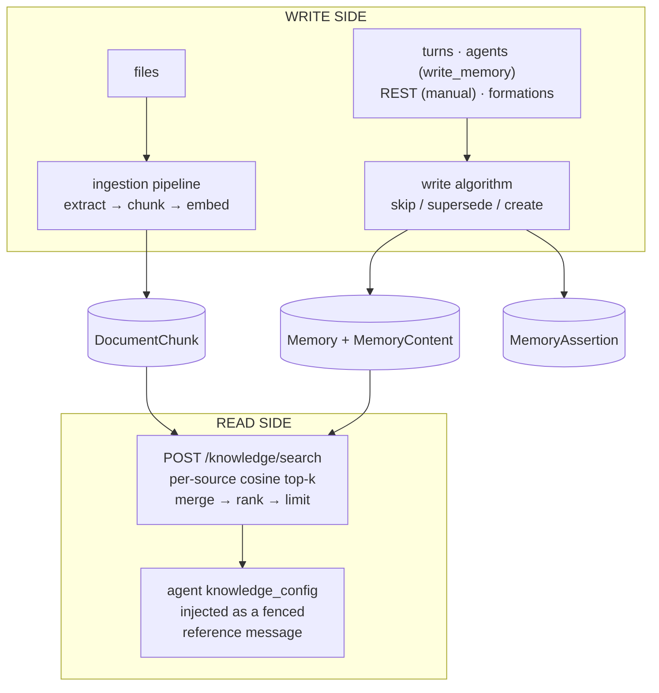

# Memory & Knowledge Engine

One engine, two sides: the **write side** turns conversations, agent decisions, and uploaded files into stored, embedded knowledge; the **read side** turns a query into ranked results and injects them into generations. Engine-side deep dive of the [engine & algorithms pattern](./engines-and-algorithms.md); caller-facing contracts: [Memories](../modules/memories.md), [Knowledge](../modules/knowledge.md), [Documents](../modules/documents.md), [Embeddings](../modules/embeddings.md), [Ingestion Rules](../modules/ingestion-rules.md). Tutorials: [Agent with Persistent Memory](/docs/tutorials/memories-agent), [Agent over a Library of PDFs](/docs/tutorials/agent-with-pdfs).

## The engine at a glance

No separate vector database, no "knowledge base" resource. Knowledge lives in **two stores** (document chunks and memories, PostgreSQL rows with pgvector embedding columns) unified **at query time** by one search function:



| Stage | Algorithm today | Configured by |
| --- | --- | --- |
| Content extraction | Native extractors (PDF, text, markdown) or a converter you provide | [Ingestion rules](../modules/ingestion-rules.md) |
| Chunking | `page` \| `whole` \| `size` (character window + overlap) | `chunk_strategy`, `chunk_size`, `chunk_overlap` |
| Embedding | One deployment-wide model | `EMBEDDING_PROVIDER`, `EMBEDDING_MODEL`, `EMBEDDING_DIMENSIONS` |
| Memory write decision | Cosine, three outcomes on every path: skip / supersede / create, no model call | `duplicate_threshold`, `supersede_threshold` (per request or per store) |
| Memory supersede | The top match is invalidated and points at a new memory holding the new text; both texts stay readable | the same threshold pair |
| Write record | One append-only assertion per write attempt, skips included | n/a — always recorded |
| Fact extraction | Tool-less LLM completion over the finished turn | `knowledge_config.extraction`, per-turn `extract` |
| Retrieval ranking | Hybrid: a vector and a full-text top-k per store, fused by reciprocal rank, then an optional recency decay on memory results | `min_similarity`, `rrf_k`, `recency_half_life_days`, `limit`, source filters |
| Injection | Fenced `<knowledge>` block as a `user`-role message | `knowledge_config` |

## The write side — how memory is created

### Four write paths, one funnel

Every memory write runs the same deduplication algorithm; the paths differ only in the context they carry:

| Path | `mechanism` | `source_type` | May set thresholds? | Generation on the assertion |
| --- | --- | --- | --- | --- |
| [`POST /api/v1/memories`](/docs/api/memories/create-memory) (manual) | `api` | `manual`, or `conversation` when the caller names one | Yes, per request | none |
| `write_memory` agent tool | `tool` | `manual` | No — the store's pair | the turn it was called in |
| [Memory rule](../modules/memories.md#memory-rules) firing on a conversation turn | `rule` | `conversation` | No — the store's pair | the turn it read |
| [Memory rule](../modules/memories.md#memory-rules) firing on a bare generation | `rule` | `manual` | No — the store's pair | the turn it read |
| Formation `memory` resource | `formation` | declared | n/a — declarative create, bypasses dedup | none |

The formation path bypasses dedup because a formation declares exact desired state. It still
records its assertion: the ledger covers every write, whichever door it came through.

### The write algorithm (deduplication)

Caller-facing contract: [Memories — Write Algorithm](../modules/memories.md#write-algorithm). Mechanically, each write:

1. **Resolves the content row.** Text is keyed per store by a sha256 of its trimmed, whitespace-collapsed form. A hash hit reuses the stored row and its vector and reaches no embedder; a miss embeds once and stores text and vector together. Embedding is best-effort: on failure the row is stored without a vector, and the next write of that text fills it in.
2. **Shortlists** the single most similar **currently-valid** memory in the target store, by pgvector cosine over the joined content row. Memories with `invalidated_at` set are never candidates.
3. **Decides** from the cosine score:
   - `score >= duplicate_threshold` (default `0.95`) → **skip**, return the existing memory.
   - `score >= supersede_threshold` (default `0.90`) → **supersede**: the match gets `invalidated_at` and `superseded_by_memory_id`, and a new memory holds the new text, inheriting the retired memory's `tags` and `metadata` under the incoming ones.
   - below it → **create** a new memory.
4. **Appends one assertion**, recording the content as asserted, the outcome, the deciding similarity, the principal, the mechanism and (on the agent doors) the generation.
5. **Returns** `{ action, ...memory }` where `action` is `created`, `superseded`, or `skipped`.

There is no model call in the algorithm. Both thresholds resolve request → store → constant; only the `api` door may set them per request ([Memories — Where the thresholds come from](../modules/memories.md#where-the-thresholds-come-from)). Cosine cutoffs depend on the embedding model: re-tune a custom pair when you change `EMBEDDING_MODEL`.

### Shared content rows

`Memory` holds identity, store, tags, metadata and validity. The text and its vector live on `MemoryContent`, unique per `(store, content hash)` and referenced by both the memory and every assertion that stated that text.

One row per distinct text per store means a fact asserted twice is embedded once and stored once, and an assertion restating known text costs no embedding call at all — the case the in-turn `tool` door hits most. The HNSW index sits on the content row's vector, while `invalidated_at` stays on the memory, so the validity filter still decides candidacy.

### The assertion ledger

Every write appends one `MemoryAssertion`, including the ones that changed nothing. Caller-facing contract: [Memories — Assertions](../modules/memories.md#assertions).

A memory row answers *what is known*. The ledger answers *who claimed it, through which door, in which turn, and what the write did* — including the skips, which produce no memory at all. `mechanism` is `rule`, not `extraction`: the post-turn pass is a `memory_rules` row with a pluggable handler, and `rule_id` names it.

### Memory rules — the ingestion policy

A completed turn does not decide for itself what a store keeps. The **store** does, through its [memory rules](../modules/memories.md#memory-rules): a selector (which agents, which event) and a pluggable **handler** that proposes facts. Structurally this is [`IngestionRule`](../modules/ingestion-rules.md) applied to turns instead of files, with the destination as the owning scope because — unlike a document — the destination is a first-class entity.

The handler is the algorithm seam. It returns candidates and never writes:

```json
{ "facts": [{ "content": "Customer prefers email", "tags": { "kind": "preference" } }] }
```

Each firing:

1. Runs **after** the turn's generation record completes, off the event bus, fire-and-forget: it never blocks or fails the turn, and a handler that throws or answers with nonsense contributes nothing.
2. Builds a transcript from the turn's recorded input messages and the assistant's reply.
3. Runs the rule's handler — the built-in extractor (a tool-less, temperature-0 completion whose response is parsed leniently between the first `[` and last `]`, capped at **20 candidates**), a handler agent, or a handler tool. Since the write algorithm has no model call in it, an agent handler and a tool handler behave identically once they return.
4. Writes each candidate through the standard write algorithm, on the store's effective thresholds and against the project's storage quota, recording a `rule` assertion that names both the rule and the turn's generation.
5. Records per-rule counts on the originating generation's `extraction` field ([Generations](../modules/generations.md) API), which also carries the `memory_assertions` rows behind them.

Because a rule subscribes to `agents.generation.completed`, it covers every transport the old agent-side extractor could not: a background generation, a streamed one, and a turn that resumed from `requires_action` all emit that event when the record completes.

A handler agent's own turn emits the same event, so the dispatcher skips a generation it started itself and any generation by an agent that handles a rule in the project; a handler generation also declares the source turn as its initiator, inheriting its trace lineage and continuation budget.

### Actor-scoped memory

Per-end-user memory is an **application-side composition**: retrieval scope comes from the agent's `knowledge_config` only; the engine stores no actor→memory-store link. Create one memory store per end user (keyed by the [Actor](../modules/actors.md)'s `external_id`, or found via store `tags`/`name`) and pass it in the per-generation `knowledge_config` override, where `memory_store_ids` union with the agent's stored scope. See [Actors — Per-Actor Memory](../modules/actors.md#per-actor-memory).

## The read side — how knowledge is retrieved

### Document ingestion pipeline

[`POST /api/v1/documents/ingest`](/docs/api/documents/ingest-document) turns an uploaded file into searchable chunks:

```
file ──► extractor ─────────► pages ──► chunking ──► embed ──► DocumentChunk rows
         │                                                       (status: pending →
         ├ native: PDF, text/plain, text/markdown                 processing → ready)
         └ ingestion rule: your tool or agent converts
           anything else (images, audio, DOCX, scans…)
```

- **Extractor routing** is per content type. PDF, plain text, and markdown extract natively. Everything else, and any PDF you want OCR'd, routes through an [ingestion rule](../modules/ingestion-rules.md): the most specific `content_type_glob` wins (fewest wildcards, then longest literal), and the rule invokes a tool (your HTTP service, an MCP tool) or an agent with the file attached. A tool converter may answer `{"status": "pending"}` and deliver pages later through a signed callback.
- **Ingestion is background by default** (`wait=true` blocks, capped by `SYNC_INGESTION_MAX_BYTES`; [`wait` contract](./sync-and-async.md)). [`GET /api/v1/documents/{document_id}/status`](/docs/api/documents/get-document-status) reports `indexed_chunks` against `total_chunks` and drives stall recovery timeouts.
- Plain text skips the pipeline: [`POST /api/v1/documents`](/docs/api/documents/create-document) creates a document from a string.

### Chunking algorithms

Chunking is a pure function from extracted pages to chunks:

| `chunk_strategy` | Behavior | Page attribution |
| --- | --- | --- |
| `page` | One chunk per extracted page | Preserved — results carry `page` |
| `whole` | The entire document as a single chunk | Dropped |
| `size` | Fixed-width **character** window over the joined text: window `chunk_size` (default `1000`), overlap `chunk_overlap` (default `200`), step = size − overlap | Dropped |

Precedence for the effective config: per-request fields → the matching ingestion rule's `chunk_strategy`/`chunk_size`/`chunk_overlap` → the entry point's default (`page` for file ingestion, `whole` for plain-text creation). The effective values are persisted on the document and read back on [`GET /api/v1/documents/{document_id}`](/docs/api/documents/get-document).

The window is character-based; there is no sentence, heading, or semantic splitter. When boundaries matter, pre-chunk and create one `whole`-strategy document per chunk ([Extending the engine today](#extending-the-engine-today)).

### Embedding

One embedding model serves the deployment (`EMBEDDING_PROVIDER` — `ollama`, `openai`, or `bedrock` — plus `EMBEDDING_MODEL` and `EMBEDDING_DIMENSIONS`; see [Embeddings](../modules/embeddings.md)). Document chunks and memories share one vector space; a query is embedded once per source and compared with pgvector cosine distance. The same model backs [`POST /api/v1/embeddings`](/docs/api/embeddings/create-embeddings).

- **The vector dimension is fixed per deployment.** `EMBEDDING_DIMENSIONS` shapes the database columns; changing models means re-ingesting documents and re-writing memories.
- **Embedding is best-effort at write time.** A chunk or memory whose embedding call failed is stored without a vector and is invisible to semantic search; re-ingesting ([`POST /api/v1/documents/{document_id}/ingest`](/docs/api/documents/reingest-document)) or re-writing repairs it.

### The retrieval algorithm

[`POST /api/v1/knowledge/search`](/docs/api/knowledge/search-knowledge), the generated `search-knowledge` SDK/CLI/MCP surface, the orchestration `knowledge` node, and agent injection all execute one function:

1. **Decide sources from filters.** Document search runs when `query`, `document_paths`, or `document_ids` is present; memory search runs when `memory_store_ids` is present. `tags` turns on both — it is the one filter that scopes either store. A bare `query` never searches memories.
2. **Run every channel in parallel.** With a `query`, each store runs two queries: `ORDER BY embedding <=> $query` (pgvector) and `to_tsvector(content) @@ websearch_to_tsquery($query)` ranked by `ts_rank_cd`, each taking `limit` rows and excluding invalidated memories. Up to four queries; each also selects the row's cosine, so a lexical-only hit still reports `similarity_score`. Without a `query`, the modes are deterministic reads: document chunks in `chunk_index` order, memories oldest-first.
3. **Filter** by `min_similarity` — raw cosine, on the **vector** candidates only, before fusion. Lexical candidates are exempt: an exact token match is its own evidence. The floor runs over the rows step 2 already took, and does not search deeper to refill: `limit: 10` with `min_similarity: 0.8` can return three rows because seven of that store's ten nearest fell below the floor, not because the corpus holds only three above it.
4. **Assemble one ranking per channel.** Each channel's two result sets are merged on that channel's own value — cosine, or `ts_rank_cd` — so a store cannot claim result slots by position alone.
5. **Fuse and cut**: `score = Σ 1 / (k + rank)` over the channels that ranked each result, `k = rrf_k` (default `60`), sorted descending, cut to `limit` (default `10`).

A channel that fails degrades rather than failing the search: a broken lexical query leaves vector-only results, and an unreachable embedding provider leaves lexical-only ones, which carry no `similarity_score`.

A server that has no embedding provider configured is not that case, and fails with `503 EMBEDDING_NOT_CONFIGURED` instead. Degrading there would answer `200` with an empty list for every natural-language query — the default `simple` text-search configuration requires every term — so a deployment missing `EMBEDDING_PROVIDER` would look like a corpus with nothing relevant in it, including through agent injection.

`document_paths` are prefixes; `tags` is an exact key-value containment match, applied at memory granularity (the memory's own tags or its store's); full filter semantics: [Knowledge — Search Modes](../modules/knowledge.md#search-modes).

On the wire, `score` is the fused value — compare within one response, nothing filters on it — while `similarity_score` is pinned forever to raw cosine; see [Knowledge — Relevance scoring](../modules/knowledge.md#relevance-scoring). How the ranking is measured: [Retrieval Quality](./retrieval-quality.md).

### Injection into generations (push retrieval)

An agent with `knowledge_config` gets retrieval on every turn, before the model is called:

1. The **query** is the latest `user` message's text.
2. The config's filters scope the search. A config that scopes only memory stores stays memory-only; the per-turn query cannot widen a memory-scoped agent into an all-project document search.
3. Results are rendered with source tags — `[Document: /path (page N)]`, `[Memory store: name (mem_...)]` — wrapped in a fenced `<knowledge>` block and prepended as a **`user`-role message**, never as `system` content.

Extraction-sourced memories contain whatever end users said, so injected knowledge never gains system authority: [Knowledge — Injected knowledge is untrusted input](../modules/knowledge.md#injected-knowledge-is-untrusted-input). Config fields and override/merge semantics: [Agents — Knowledge Config](../modules/agents.md#knowledge-config).

### Pull retrieval (agent-driven)

Push injection retrieves once, up front. For the agent to decide *whether* and *what* to retrieve over multiple steps, bind the `search-knowledge` operation to it as a `builtin`-type [tool](../modules/tools.md). Both compose: a small always-on injected context plus pull on demand. See [Agent over a Library of PDFs — Step 12](/docs/tutorials/agent-with-pdfs#step-12--give-the-agent-a-knowledge-tool-plan-d).

Orchestrations read knowledge mid-flow with the `knowledge` node. There is no declarative write node: a graph that must persist a fact uses an `agent` node whose `knowledge_config.write_memory_store_id` is set, or writes through the API — see [Orchestrations](../modules/orchestrations.md).

## Every knob in one place

| Knob | Wire location | Default | Governs |
| --- | --- | --- | --- |
| `duplicate_threshold` | [`POST /api/v1/memories`](/docs/api/memories/create-memory) body | `0.95` | skip band of the write algorithm |
| `chunk_strategy` / `chunk_size` / `chunk_overlap` | document create/ingest bodies; ingestion rules | `page` (ingest) / `whole` (create); `1000`; `200` | chunking |
| `native_extraction` | ingestion rule | `first` | run native extraction before the converter (`skip` to always convert) |
| `file_delivery` | ingestion rule | `base64` | how the converter receives the file (`download_url` for large files) |
| `query`, `min_similarity`, `rrf_k`, `recency_half_life_days`, `limit`, `memory_store_ids`, `document_ids`, `document_paths`, `tags` | [`POST /api/v1/knowledge/search`](/docs/api/knowledge/search-knowledge) body | `limit: 10`, `rrf_k: 60`, `recency_half_life_days: 0` | retrieval |
| `KNOWLEDGE_TEXT_SEARCH_CONFIG`, `KNOWLEDGE_RRF_K`, `KNOWLEDGE_RECENCY_HALF_LIFE_DAYS` | server environment | `simple`, `60`, `0` | the lexical channel, the fusion constant and the memory recency decay |
| `knowledge_config.{memory_store_ids, document_ids, document_paths, tags, min_score, limit}` | agent record; per-generation override (arrays unioned, `tags` merged per key, scalars overridden) | `limit: 5` injected | push retrieval |
| `knowledge_config.write_memory_store_id` | agent record | — | injects the `write_memory` tool |
| `on`, `source_agent_ids`, `enabled` | [memory rule](../modules/memories.md#memory-rules) | — | which turns a store ingests |
| `agent_id` / `tool_id` (+ `action`, `preset_parameters`) | memory rule | built-in extractor | the handler that proposes facts |
| `prompt`, `ai_provider_id`, `model` | memory rule | built-in instructions, the source agent's provider/model | the built-in extractor's completion |
| `include_invalidated` | [`GET /api/v1/memories`](/docs/api/memories/list-memories) query | `false` | whether superseded memories appear in listings |
| `EMBEDDING_*` env vars | server environment | — | the shared vector space |

Fixed today (no knob): the cosine distance metric, the content hash's normalization, the fusion formula itself and the relative weight of the two channels, the decay curve behind `recency_half_life_days` (a plain exponential, with no floor damping it), the injection preamble and source-tag format, the built-in extractor's candidate cap (20), and the per-source embedding concurrency during ingestion.

## Extending the engine today

The same seam shape the evaluations engine exposes as [custom scorers](../modules/evaluations.md#custom-scorers-tool):

- **Custom content extraction — first-class.** An [ingestion rule](../modules/ingestion-rules.md) pointing at your own tool: OCR, audio transcription, layout-aware PDF parsing, table extraction — anything answering with pages of text, synchronously or via the deferred callback.
- **Custom chunking — via pre-chunking.** Run your own splitter and create one document per chunk with `chunk_strategy: whole`, encoding structure in `path`, `title`, `tags`, and `metadata`. Retrieval treats your chunks like engine-made ones.
- **Custom post-turn ingestion — first-class.** A [memory rule](../modules/memories.md#memory-rules) `prompt`/`ai_provider_id`/`model` retunes the built-in fact miner; an `agent_id` or `tool_id` handler replaces the algorithm outright, returning candidates the engine still puts through its own write funnel.
- **Custom write policy.** A corpus's dedup policy is tuned once as the store's `duplicate_threshold` / `supersede_threshold`; a curation pipeline writing through [`POST /api/v1/memories`](/docs/api/memories/create-memory) may also override either per write. Lower `duplicate_threshold` to skip more aggressively, raise it toward `1.0` to keep near-duplicates distinct; raise `supersede_threshold` to retire fewer facts.
- **Custom retrieval composition.** Exact-term matching no longer needs an index of your own — the lexical channel is built in, and a recency decay on memory results is one knob (`recency_half_life_days`). For reranking, or fusion with a signal the engine does not have, call [`POST /api/v1/knowledge/search`](/docs/api/knowledge/search-knowledge) with a generous `limit`, re-rank on your side using `similarity_score` plus your own features, and pass the survivors as input messages.

## Design headroom — where the engine is going

None of the following has shipped; what has shipped is the room for it:

- **A same-fact judge for the band below `supersede_threshold`.** One boolean call in front of the supersede branch, never writing prose, would let the floor drop toward `0.75` without risking a wrongly retired fact. It is gated on what the [assertion ledger](#the-assertion-ledger) shows about outcomes in that band.
- **`score` is implementation-defined while `similarity_score` is pinned**, so hybrid retrieval (lexical search alongside vectors, rank fusion, an optional rerank stage, recency weighting for memories) can refill `score` as an internal upgrade.
- **A retrieval evaluation harness** (golden query sets, recall@k / MRR) is sequenced before ranking changes.
- **An entity graph over memories** (structured subject–predicate–object queries) is designed but demand-gated.

Design records: [`docs/prd-memories.md`](https://github.com/ttoss/soat/blob/main/docs/prd-memories.md), [`docs/prd-knowledge.md`](https://github.com/ttoss/soat/blob/main/docs/prd-knowledge.md), [`docs/roadmap.md`](https://github.com/ttoss/soat/blob/main/docs/roadmap.md). Treat them as direction, not behavior.

## Invariants

Whatever algorithm runs at each stage:

- **Writes are never lost to an LLM failure.** The write algorithm calls no model at all; a handler failure is logged and skipped.
- **Every write leaves a record.** One assertion per attempt, including the skips, whichever door it came through.
- **Invalidated memories never reach a generation.** Superseded facts are excluded from search, injection, and dedup, but stay readable by ID ([`GET /api/v1/memories/{memory_id}`](/docs/api/memories/get-memory)) for audit.
- **Retrieved knowledge never gains `system` authority.** Injection is fenced, framed as reference material, and delivered as a `user` message; the built-in extractor runs tool-less.
- **Every injected claim is traceable.** Source tags carry the memory ID or document path and page; a memory's assertions link back to the principal, the door and the turn that produced the fact.
- **Slow stages never sit on the request path.** A rule firing is fire-and-forget off the event bus; ingestion is background by default; write latency stays embedding-bound.
- **One write funnel, one search function.** Every write path shares the dedup algorithm and the ledger; every retrieval surface shares the ranking.
