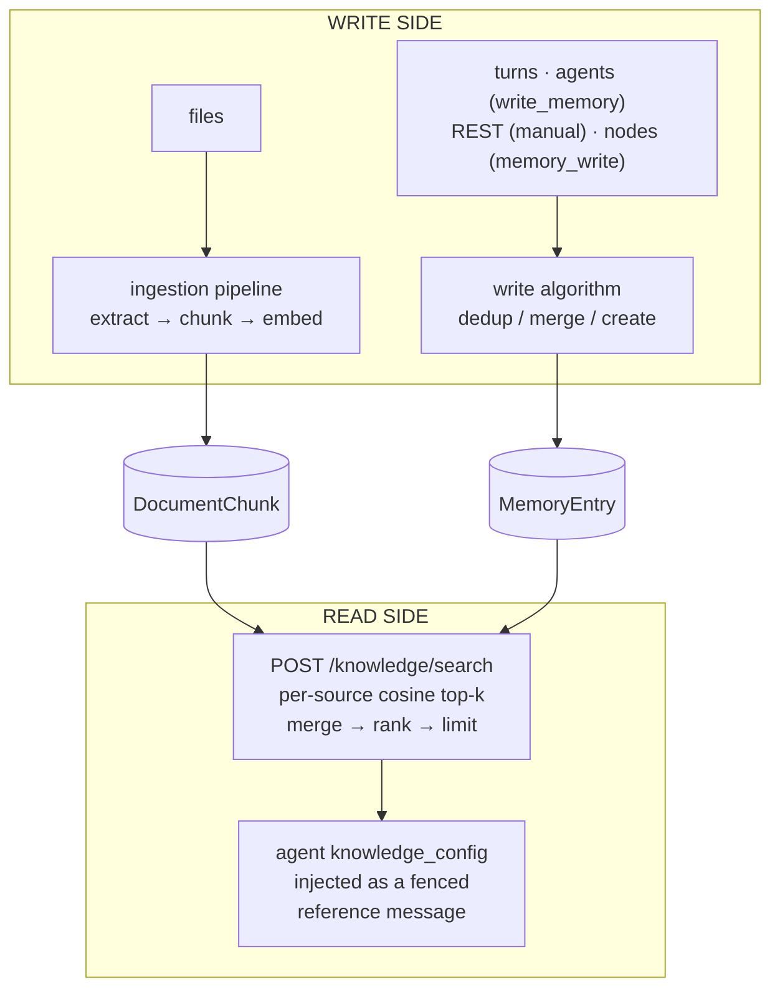

# Memory & Knowledge Engine

SOAT's memory and knowledge system is one engine with two sides. The **write side** turns conversations, agent decisions, and uploaded files into stored, embedded knowledge. The **read side** turns a query into ranked results and injects them into generations. This page explains the whole mechanism — the data flow, every algorithm the engine runs today with its exact configuration knobs, and the extension seams the design deliberately keeps open. It is the engine-side deep dive of the [engine & algorithms pattern](./engines-and-algorithms.md) for this module pair.

It complements the module pages, which own the caller-facing contracts: [Memories](../modules/memories.md), [Knowledge](../modules/knowledge.md), [Documents](../modules/documents.md), [Embeddings](../modules/embeddings.md), and [Ingestion Rules](../modules/ingestion-rules.md). For a hands-on walkthrough, follow [Agent with Persistent Memory](/docs/tutorials/memories-agent) and [Agent over a Library of PDFs](/docs/tutorials/agent-with-pdfs).

## The engine at a glance

There is no separate vector database and no "knowledge base" resource. Knowledge lives in **two stores** — document chunks and memory entries, both rows in PostgreSQL with pgvector embedding columns — and is unified **at query time** by a single search function:



Every stage in that picture is an algorithm with a name, a default, and (in most cases) a knob:

| Stage | Algorithm today | Configured by |
| --- | --- | --- |
| Content extraction | Native extractors (PDF, text, markdown) or a converter you provide | [Ingestion rules](../modules/ingestion-rules.md) |
| Chunking | `page` \| `whole` \| `size` (character window + overlap) | `chunk_strategy`, `chunk_size`, `chunk_overlap` |
| Embedding | One deployment-wide model | `EMBEDDING_PROVIDER`, `EMBEDDING_MODEL`, `EMBEDDING_DIMENSIONS` |
| Memory write decision | Cosine dedup: skip / create everywhere; merge band on agent paths only | `duplicate_threshold` |
| Memory merge | LLM consolidation into one atomic fact; a failed or blank completion creates instead | presence of an agent context; extraction's provider/model override |
| Fact extraction | Tool-less LLM completion over the finished turn | `knowledge_config.extraction`, per-turn `extract` |
| Retrieval ranking | Cosine similarity top-k per source, merged and re-sorted | `min_score`, `limit`, source filters |
| Injection | Fenced `<knowledge>` block as a `user`-role message | `knowledge_config` |

## The write side — how memory is created

### Five write paths, one funnel

Every memory write in SOAT — no matter where it originates — flows through the same lib function and therefore the same deduplication algorithm. The paths differ only in what context they carry:

| Path | `source_type` | LLM merge? | Provenance recorded |
| --- | --- | --- | --- |
| [`POST /api/v1/memory-entries`](/docs/api/memoryEntries/create-memory-entry) (manual) | `manual` | No — similar facts create | none |
| `write_memory` agent tool | `agent` | Yes (agent's provider) | source generation |
| [Automatic extraction](../modules/memories.md#automatic-extraction) | `extraction` | Yes (extraction's provider) | source generation + conversation |
| Orchestration `memory_write` node | `orchestration` | No — similar facts create | none |
| Formation `memory_entry` resource | declared | n/a — declarative create, bypasses dedup | none |

The single funnel is a deliberate design property: a new write algorithm (or a pluggable one) changes **one** decision function and every path inherits it. The formation path is the one exception — a formation declares exact desired state, so deduplication would fight convergence.

### The write algorithm (deduplication)

The caller-facing contract is documented in [Memories — Write Algorithm](../modules/memories.md#write-algorithm); mechanically, each write runs:

1. **Embed** the incoming content. Embedding is best-effort — on failure the write proceeds and the entry is stored without a vector (it will not be retrievable by semantic search until re-written).
2. **Shortlist**: find the single most similar **currently-valid** entry in the target memory by pgvector cosine distance. Entries with `invalidated_at` set are never candidates — restating superseded knowledge always creates a fresh entry.
3. **Decide** from the cosine score:
   - `score >= duplicate_threshold` (default `0.95`) → **skip**, return the existing entry.
   - similar but below the duplicate bar (at or above a fixed `0.75` floor), **and the write carries an agent context** → **merge** by LLM consolidation (next section), re-embed.
   - everything else → **create** a new entry.
4. **Return** `{ action, ...entry }` where `action` is `created`, `updated`, or `skipped`. The enum also reserves `superseded` — the contradiction-arbitration outcome — so clients can handle it before the write path that produces it ships (see [Design headroom](#design-headroom--where-the-engine-is-going)).

`duplicate_threshold` is a **per-request field** on [`POST /api/v1/memory-entries`](/docs/api/memoryEntries/create-memory-entry) only; the tool, extraction, and orchestration paths always use the default. Because cosine cutoffs are coupled to the embedding model, re-tune a custom threshold when you change `EMBEDDING_MODEL`.

### The merge (consolidation) algorithm

Merging is exclusively an **agent-path** behavior: only the `write_memory` tool and extraction carry the context it needs. A tool-less, temperature-0 completion is asked to merge the existing and incoming facts into a **single, self-contained sentence**, preferring the new fact on contradiction. This keeps entries atomic — an entry that grows into a multi-fact paragraph drifts away from every individual fact it contains, degrading retrieval.

Nothing is ever appended to an existing entry. A write with no agent context (manual REST, the orchestration node), and an agent-path write whose consolidation completion fails or comes back blank, **creates** instead — so no write can lose a fact, at the accepted cost of a possible near-duplicate pair until arbitration ships.

On a merge, incoming `tags` are unioned into the existing entry's tags and `metadata` is shallow-merged (incoming keys win). Provenance (`source_generation_id`, `source_conversation_id`) is recorded at creation and **never rewritten by a later merge** — it names the turn that first asserted the fact.

### The extraction algorithm

Extraction is the passive-memory pipeline: it mines atomic facts out of finished turns without the agent calling any tool. It is opt-in per agent via `knowledge_config.extraction` + `write_memory_id`, overridable per turn with the `extract` boolean — the configuration surface is documented in [Memories — Automatic Extraction](../modules/memories.md#automatic-extraction).

Mechanically, each extraction run:

1. Fires **after** the turn completes, fire-and-forget — it never blocks or fails the generation response.
2. Builds a transcript from the turn's `user`/`assistant` string messages and sends a tool-less, temperature-0 completion. A custom `extraction.prompt` replaces only the task instructions; the JSON-array response contract and the transcript are always appended by the engine, because the parser accepts nothing else.
3. Parses the response leniently (the text between the first `[` and last `]`), accepts strings or `{"content": "..."}` objects, and caps candidates at **20 per turn**.
4. Writes each candidate through the standard write algorithm — so extraction inherits dedup and LLM consolidation automatically.
5. Records `{ candidates, created, updated, skipped }` on the originating generation's `extraction` field for observability via the [Generations](../modules/generations.md) API.

**Coverage matrix** — which turn types extract today:

| Turn type | Extracts? |
| --- | --- |
| Conversation / session turn (any `wait` mode) | ✅ — fired after the assistant message persists |
| Direct [`POST /api/v1/agents/{agent_id}/generate`](/docs/api/agents/create-agent-generation), blocking (`wait=true`) | ✅ |
| Direct generation, background (`wait` omitted) | ❌ |
| Streaming generation | ❌ |
| `requires_action` (client-tool) turn | ❌ |

The gaps are known and tracked (see [Design headroom](#design-headroom--where-the-engine-is-going)) — until they close, the reliable way to capture facts from streaming traffic is the `write_memory` tool, which works on every transport.

### Actor-scoped memory

Per-end-user memory is an **application-side composition**: retrieval scope for a generation comes from the agent's `knowledge_config` and nothing else — the engine stores no actor→memory link and resolves nothing implicitly at generation time. Create one memory per end user (keyed by the [Actor](../modules/actors.md)'s `external_id`, or found via memory `tags`/`name`), and pass it in the per-generation `knowledge_config` override, where `memory_ids` union with the agent's stored scope. This keeps memory scoping explicit and auditable; the pattern is documented in [Actors — Per-Actor Memory](../modules/actors.md#per-actor-memory).

## The read side — how knowledge is retrieved

### Document ingestion pipeline

[`POST /api/v1/documents/ingest`](/docs/api/documents/ingest-document) turns an uploaded file into searchable chunks:

```
file ──► extractor ─────────► pages ──► chunking ──► embed ──► DocumentChunk rows
         │                                                       (status: pending →
         ├ native: PDF, text/plain, text/markdown                 processing → ready)
         └ ingestion rule: your tool or agent converts
           anything else (images, audio, DOCX, scans…)
```

- **Extractor routing** is per content type. PDF, plain text, and markdown extract natively. Everything else — and any PDF you want OCR'd — routes through an [ingestion rule](../modules/ingestion-rules.md): the most specific `content_type_glob` wins (fewest wildcards, then longest literal), and the rule invokes either a tool (your HTTP service, an MCP tool) or an agent with the file attached. A tool converter may answer `{"status": "pending"}` and deliver pages later through a signed callback, which is how long-running OCR or transcription integrates.
- **Ingestion is background by default** (`wait=true` blocks, capped by `SYNC_INGESTION_MAX_BYTES`) — the [`wait` contract](./sync-and-async.md) applies. Progress is observable live via [`GET /api/v1/documents/{document_id}/status`](/docs/api/documents/get-document-status), which reports `indexed_chunks` against `total_chunks` and drives stall recovery timeouts.
- Plain text can skip the pipeline entirely: [`POST /api/v1/documents`](/docs/api/documents/create-document) creates a document from a string.

### Chunking algorithms

Chunking is a pure function from extracted pages to chunks, with three strategies:

| `chunk_strategy` | Behavior | Page attribution |
| --- | --- | --- |
| `page` | One chunk per extracted page | Preserved — results carry `page` |
| `whole` | The entire document as a single chunk | Dropped |
| `size` | Fixed-width **character** window over the joined text: window `chunk_size` (default `1000`), overlap `chunk_overlap` (default `200`), step = size − overlap | Dropped |

Precedence for the effective config: per-request fields → the matching ingestion rule's `chunk_strategy`/`chunk_size`/`chunk_overlap` → the entry point's default (`page` for file ingestion, `whole` for plain-text creation). The effective values are persisted on the document and read back on [`GET /api/v1/documents/{document_id}`](/docs/api/documents/get-document).

The window is character-based, not token- or structure-aware — there is no sentence, heading, or semantic splitter today. When chunk boundaries matter, the engine's escape hatch is to chunk in your own pipeline and create one `whole`-strategy document per chunk (see [Extending the engine today](#extending-the-engine-today)).

### Embedding

One embedding model serves the whole deployment, configured by environment (`EMBEDDING_PROVIDER` — `ollama`, `openai`, or `bedrock` — plus `EMBEDDING_MODEL` and `EMBEDDING_DIMENSIONS`; see [Embeddings](../modules/embeddings.md)). Document chunks and memory entries share the same vector space, which is what makes the unified search possible: a query is embedded once per source and compared against both stores with pgvector cosine distance.

Two operational consequences:

- **The vector dimension is fixed per deployment.** `EMBEDDING_DIMENSIONS` shapes the database columns, so changing models means re-embedding stored content (re-ingest documents; re-write memory entries).
- **Embedding is best-effort at write time.** A chunk or entry whose embedding call failed is stored without a vector and is invisible to semantic search — re-ingesting the document ([`POST /api/v1/documents/{document_id}/ingest`](/docs/api/documents/reingest-document)) or re-writing the entry repairs it.

The same model also backs the raw [`POST /api/v1/embeddings`](/docs/api/embeddings/create-embeddings) endpoint for application-side vector work.

### The retrieval algorithm

[`POST /api/v1/knowledge/search`](/docs/api/knowledge/search-knowledge) is the one retrieval entry point — the REST endpoint, the generated `search-knowledge` SDK/CLI/MCP surface, the orchestration `knowledge` node, and agent injection all execute the same function:

1. **Decide sources from filters.** Document search runs when `query`, `document_paths`, or `document_ids` is present; memory search runs only when `memory_ids` or `memory_tags` is present. A bare `query` never searches memories — memory retrieval is always explicitly scoped.
2. **Search each source in parallel.** With a `query`, each source embeds it and takes the top `limit` rows by cosine similarity (`score = 1 − cosine distance`), excluding invalidated memory entries. Without a `query`, the modes are deterministic reads: document chunks in `chunk_index` order, memory entries oldest-first.
3. **Filter** by `min_score` (applied to `score`, after each source's top-k — a high floor shrinks the result set rather than searching deeper).
4. **Merge and rank**: concatenate both lists, sort by descending `score` when a `query` ran, and cut to `limit` (default `10`).

`memory_tags` matches at entry granularity with glob patterns, `document_paths` are prefixes — the full filter semantics live in [Knowledge — Search Modes](../modules/knowledge.md#search-modes).

Ranking today is **single-signal**: `score` equals the raw cosine similarity. The wire contract is deliberately looser than the implementation — `score` is an implementation-defined ranking (compare within one response; `min_score` filters on it), while `similarity_score` is pinned forever to raw cosine. That split is what lets a future fused ranking ship without an API break; see [Knowledge — Relevance scoring](../modules/knowledge.md#relevance-scoring) for how to consume each field.

### Injection into generations (push retrieval)

An agent with `knowledge_config` gets retrieval on every turn, before the model is called:

1. The **query** is the latest `user` message's text.
2. The config's filters scope the search. A config that scopes only memories stays memory-only — the per-turn query cannot silently widen a memory-scoped agent into an all-project document search.
3. Results are rendered with source tags — `[Document: /path (page N)]`, `[Memory: name (mem_entry_...)]` — so every injected claim is traceable to the exact chunk or entry, then wrapped in a fenced `<knowledge>` block and prepended as a **`user`-role message**, never as `system` content.

The role choice is a security decision, not a formatting one: extraction-sourced entries contain whatever end users said, so injected knowledge must never gain system authority. The full threat model is documented in [Knowledge — Injected knowledge is untrusted input](../modules/knowledge.md#injected-knowledge-is-untrusted-input); the config fields and per-generation override/merge semantics in [Agents — Knowledge Config](../modules/agents.md#knowledge-config).

### Pull retrieval (agent-driven)

Push injection is one-shot: the engine retrieves once, up front, against the latest message. When the agent should decide *whether* and *what* to retrieve — refining queries over multiple steps — bind the `search-knowledge` operation to the agent as a `soat`-type [tool](../modules/tools.md). The two modes compose: inject a small always-on context and let the agent pull more on demand. [Agent over a Library of PDFs — Step 12](/docs/tutorials/agent-with-pdfs#step-12--give-the-agent-a-knowledge-tool-plan-d) walks through it.

Orchestrations read knowledge mid-flow with the `knowledge` node and write memory with the `memory_write` node — see [Orchestrations](../modules/orchestrations.md).

## Every knob in one place

| Knob | Wire location | Default | Governs |
| --- | --- | --- | --- |
| `duplicate_threshold` | [`POST /api/v1/memory-entries`](/docs/api/memoryEntries/create-memory-entry) body | `0.95` | skip band of the write algorithm |
| `chunk_strategy` / `chunk_size` / `chunk_overlap` | document create/ingest bodies; ingestion rules | `page` (ingest) / `whole` (create); `1000`; `200` | chunking |
| `native_extraction` | ingestion rule | `first` | run native extraction before the converter (`skip` to always convert) |
| `file_delivery` | ingestion rule | `base64` | how the converter receives the file (`download_url` for large files) |
| `query`, `min_score`, `limit`, `memory_ids`, `memory_tags`, `document_ids`, `document_paths` | [`POST /api/v1/knowledge/search`](/docs/api/knowledge/search-knowledge) body | `limit: 10` | retrieval |
| `knowledge_config.{memory_ids, memory_tags, document_ids, document_paths, min_score, limit}` | agent record; per-generation override (arrays unioned, scalars overridden) | `limit: 5` injected | push retrieval |
| `knowledge_config.write_memory_id` | agent record | — | injects the `write_memory` tool; extraction target |
| `knowledge_config.extraction` (`enabled`, `ai_provider_id`, `model`, `prompt`) | agent record | off | the extraction algorithm |
| `extract` | [`POST /api/v1/agents/{agent_id}/generate`](/docs/api/agents/create-agent-generation) body | follow agent config | per-turn extraction gate |
| `include_invalidated` | [`GET /api/v1/memory-entries`](/docs/api/memoryEntries/list-memory-entries) query | `false` | whether superseded entries appear in listings |
| `EMBEDDING_*` env vars | server environment | — | the shared vector space |

Fixed by design today (no knob): the cosine distance metric, the merge band's `0.75` floor (agent paths only), the retrieval ranking formula, the injection preamble and source-tag format, the extraction candidate cap (20), and the per-source embedding concurrency during ingestion.

## Extending the engine today

The engine already has one fully pluggable stage and several composition points that amount to "bring your own algorithm" (the same seam shape the evaluations engine exposes as [custom scorers](../modules/evaluations.md#custom-scorers-tool)):

- **Custom content extraction — first-class.** An [ingestion rule](../modules/ingestion-rules.md) pointing at your own tool *is* a pluggable extraction algorithm: OCR, audio transcription, layout-aware PDF parsing, table extraction — anything that can answer with pages of text, synchronously or via the deferred callback. This is the sanctioned way to teach SOAT a new file type or a better extractor.
- **Custom chunking — via pre-chunking.** Run your own splitter (semantic, token-based, heading-aware) and create one document per chunk with `chunk_strategy: whole`, encoding structure in `path`, `title`, `tags`, and `metadata`. Retrieval treats your chunks identically to engine-made ones.
- **Custom extraction behavior.** `extraction.prompt` changes *what* the fact miner looks for (domain-specific facts, a narrower definition of "worth remembering") while the engine keeps the response contract; `extraction.ai_provider_id`/`model` route it to a cheaper or better model.
- **Custom write policy.** Curation pipelines that write through [`POST /api/v1/memory-entries`](/docs/api/memoryEntries/create-memory-entry) can tune `duplicate_threshold` per write — e.g. lower the bar to skip more aggressively on a high-churn feed, or raise it toward `1.0` to keep near-duplicates as distinct facts. Manual writes never merge, so every accepted fact lands as its own atomic entry.
- **Custom retrieval composition.** For ranking the engine doesn't do yet — reranking, fusion with your own lexical index, recency weighting — call [`POST /api/v1/knowledge/search`](/docs/api/knowledge/search-knowledge) with a generous `limit`, re-rank on your side using `similarity_score` (the stable signal) plus your own features, and pass the survivors as input messages. Context composition is deliberately the application's job in SOAT, so this pattern is supported, not a workaround.

## Design headroom — where the engine is going

The engine's contracts were shaped so retrieval and write quality can improve **without breaking the wire**. None of the following has shipped; what has shipped is the room for it:

- **`action: "superseded"` is already in the write response contract**, and entries already carry `invalidated_at` / `superseded_by_entry_id` with retrieval, listing, and dedup excluding invalidated entries. The planned LLM-arbitrated write decision (shortlist top-K candidates, let a model choose add / update / supersede / skip) populates a schema that is already live — contradictions will retire facts through the supersede chain instead of coexisting with them.
- **`score` is implementation-defined while `similarity_score` is pinned**, precisely so hybrid retrieval — lexical search alongside vectors, rank fusion across sources, an optional rerank stage, recency weighting for memories — can refill `score` with a fused value as an internal upgrade.
- **Extraction coverage for streaming and client-tool turns** closes the coverage matrix above without any API change.
- **A retrieval evaluation harness** (golden query sets, recall@k / MRR) is sequenced before ranking changes, so "better retrieval" becomes a measured, regression-gated property.
- **An entity graph over memory entries** (structured subject–predicate–object queries) is designed but demand-gated.

The design records live in the repository — [`docs/prd-memories.md`](https://github.com/ttoss/soat/blob/main/docs/prd-memories.md), [`docs/prd-knowledge.md`](https://github.com/ttoss/soat/blob/main/docs/prd-knowledge.md), and [`docs/roadmap.md`](https://github.com/ttoss/soat/blob/main/docs/roadmap.md) — including the sequencing and the gates. Treat everything in them as direction, not behavior.

## Invariants

Whatever algorithm runs at each stage, these properties hold across the engine and are safe to build on:

- **Writes are never lost to an LLM failure.** Consolidation and (future) arbitration degrade to deterministic fallbacks; extraction failures are logged and skipped.
- **Invalidated entries never reach a generation.** Superseded facts are excluded from search, injection, and dedup — but stay readable by ID ([`GET /api/v1/memory-entries/{entry_id}`](/docs/api/memoryEntries/get-memory-entry)) for audit.
- **Retrieved knowledge never gains `system` authority.** Injection is fenced, framed as reference material, and delivered as a `user` message; extraction runs tool-less.
- **Every injected claim is traceable.** Source tags carry the entry ID or document path and page; entry provenance links back to the generation and conversation that produced a fact.
- **Slow stages never sit on the request path.** Extraction is fire-and-forget; ingestion is background by default; write latency stays embedding-bound.
- **One write funnel, one search function.** Every write path shares the dedup algorithm; every retrieval surface shares the ranking — an engine improvement lands everywhere at once.
