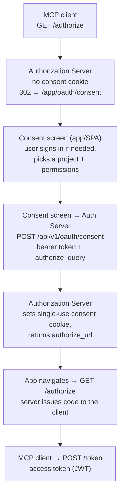

import Tabs from '@theme/Tabs';
import TabItem from '@theme/TabItem';

# OAuth

SOAT is a first-party **OAuth 2.1 Authorization Server** for its MCP endpoint. MCP clients (Claude, Cursor, VS Code) discover the server, register dynamically, run authorize + PKCE against a SOAT-hosted **consent screen**, and receive an access token scoped to one project and a chosen permission set.

Protocol mechanics (discovery, Dynamic Client Registration, PKCE, token grants) come from [`@ttoss/http-server-auth`](https://ttoss.dev) and [`@ttoss/auth-core`](https://ttoss.dev). SOAT owns token minting, consent, refresh validation, and the consent screen.

> See the [Permissions Reference](../permissions.md) for the IAM action strings for this module.

## Discovery endpoints

A client is pointed at the deployment's base URL and discovers everything else; no operator step is needed.

| Path | Spec | What it answers |
|---|---|---|
| [`GET /.well-known/oauth-authorization-server`](/docs/api/oauth/get-oauth-authorization-server-metadata) | [RFC 8414](https://www.rfc-editor.org/rfc/rfc8414) | Where `/authorize`, `/token` and `/register` are, which grants and PKCE methods are supported, and which scopes exist |
| [`GET /.well-known/oauth-protected-resource`](/docs/api/oauth/get-oauth-protected-resource-metadata) | [RFC 9728](https://www.rfc-editor.org/rfc/rfc9728) | That `/mcp` is a protected resource, and which authorization server guards it |
| [`POST /register`](/docs/api/oauth/register-oauth-client) | [RFC 7591](https://www.rfc-editor.org/rfc/rfc7591) | Dynamic Client Registration — the client mints its own `client_id` |
| [`GET /authorize`](/docs/api/oauth/authorize-oauth-client) | OAuth 2.1 | Authorization request; redirects to the consent screen when no grant exists |
| [`POST /token`](/docs/api/oauth/create-oauth-token) | OAuth 2.1 | Authorization-code (PKCE) and refresh-token grants |

All five are served unauthenticated where the protocol requires it.

They are declared in the published OpenAPI description ([`/openapi.json`](https://soat.ttoss.dev/openapi.json)) but, because their paths are fixed by the RFCs and sit outside `/api/v1`, **not** wrapped by the generated SDK, CLI, or MCP surface: `/authorize` is a browser redirect and `/token` takes a form-encoded body. Errors use the RFC 6749 shape (`{ error, error_description }`), not SOAT's `{ code, message, hint, docs_url }`, because an OAuth client branches on `error`.

```bash
curl -s http://localhost:5047/.well-known/oauth-authorization-server | jq
```

```json
{
  "issuer": "http://localhost:5047",
  "authorization_endpoint": "http://localhost:5047/authorize",
  "token_endpoint": "http://localhost:5047/token",
  "registration_endpoint": "http://localhost:5047/register",
  "response_types_supported": ["code"],
  "grant_types_supported": ["authorization_code", "refresh_token"],
  "code_challenge_methods_supported": ["S256"],
  "token_endpoint_auth_methods_supported": [
    "client_secret_basic",
    "client_secret_post",
    "none"
  ],
  "scopes_supported": ["mcp:access"]
}
```

`issuer`, and every advertised endpoint, comes from `SOAT_BASE_URL`; unset, it advertises `localhost`, unreachable remotely. See [Configuration](#configuration).

`code_challenge_methods_supported` is `["S256"]` only; `plain` is not offered.

## Flow



Login is handled by the app (SPA): `/authorize` redirects to the consent screen at `/app/oauth/consent`, where normal sign-in applies; the screen then calls the JSON API below with the user's bearer token. The server renders no login or consent page.

## Consent screen

The consent screen (`packages/app`, `src/oauth/consentView.tsx`) lets the user pick **one project** and grant permissions at three tiers:

| Tier | Control | Resulting scope |
|---|---|---|
| **All** | "Grant all permissions" toggle | `*` |
| **Module** (intermediary) | per-module checkbox (selects every action of that module) | `<module>:*` |
| **Granular** | individual action checkboxes | `<module>:<Action>` |

The catalog is derived from `packages/server/src/permissions/*.json`.

Whatever the tier, the grant is scoped to the project via `srn:<project_id>:*:*`, carried in the token's `scope` claim and rebuilt into an IAM [policy document](./policies.md) on every request; see [Permission enforcement](#permission-enforcement).

## Permission enforcement

An access token is a **scoped credential** evaluated by the same IAM evaluator as [API keys](./api-keys.md#permission-inheritance). On each request the server rebuilds the consent policy from `scope` (stripping the synthetic `mcp:access` and `prj:<id>` markers) and evaluates the **intersection** of:

1. the owning user's policies (the ceiling, even for an admin), and
2. the consented scope, within `srn:<project_id>:*:*`.

Both must allow. A consent with no action scopes grants nothing; the `prj` claim hard-locks every request to the consented project.

## Design: one project per token

A token is scoped to exactly **one** project: single-project selector, single `project_id` on `/api/v1/oauth/consent`, single `prj` claim backed by `srn:<project_id>:*:*`.

### Why

- **Ambient project scope.** MCP tool calls never carry a `project_id` the model could get wrong.
- **Minimal blast radius.** A leaked token reaches one project; the policy is trivial to audit.
- **Comprehensible consent.** "Grant this client *Project X* with these permissions" is evaluable at a glance.

### Working across multiple projects

Run the consent flow once per project and configure one MCP server entry per token; the prior token is unaffected.

## Data model

OAuth is not a CRUD resource; two bearer-authenticated JSON operations back the consent screen.

### Consent info (response)

| Field      | Type     | Description                                                        |
|------------|----------|--------------------------------------------------------------------|
| `projects` | object[] | Projects the caller can grant access to (`id`, `name` each)        |
| `modules`  | object[] | Permission catalog — modules and their granular actions           |

### Consent decision (request)

| Field             | Type   | Required | Description                                                                 |
|-------------------|--------|----------|-----------------------------------------------------------------------------|
| `project_id`      | string | Yes      | The single project the grant is scoped to                                   |
| `selection`       | object | Yes      | Chosen permissions: `{ kind: "all" }`, `{ kind: "modules", modules }`, or `{ kind: "actions", actions }` |
| `authorize_query` | string | No       | The original OAuth `/authorize` query string; when present, completes the flow |

### Consent decision (response)

| Field           | Type     | Description                                                                    |
|-----------------|----------|--------------------------------------------------------------------------------|
| `project_id`    | string   | The project the grant is scoped to                                             |
| `scopes`        | string[] | Granted permission scopes                                                      |
| `policy`        | object   | The project-scoped IAM [policy document](./policies.md) the token would carry  |
| `authorize_url` | string   | Present only when `authorize_query` was supplied — URL for the app to navigate back to |

Registered clients, authorization codes, and consent grants live in single-use, short-lived server-side stores, not exposed through the API.

## Access token

The access token is an HS256 JWT (`@ttoss/auth-core` `signJwt`) carrying:

- `sub` — the SOAT user's public id
- `scope` — space-separated granted scopes, plus `mcp:access` and a
  `prj:<project_id>` marker
- `prj` — the granted project's public id

## Configuration

| Variable | Default | Purpose |
|---|---|---|
| `SOAT_BASE_URL` | `http://localhost:<PORT>` | OAuth issuer / resource identifier advertised in discovery metadata |
| `JWT_SECRET` | `dev-secret` | HS256 signing secret for issued access tokens |

## Examples

The JSON operations are called by MCP clients and the in-app consent screen with a user bearer token; they are **not exposed through the CLI or SDK**. The examples below use `curl`.

### Fetch consent-screen data

Returns the projects the caller can grant and the permission catalog.

<Tabs groupId="client">
<TabItem value="cli" label="CLI" default>

No CLI command — the consent screen is rendered by the app, not the CLI.

</TabItem>
<TabItem value="sdk" label="SDK">

No SDK method — this endpoint backs the app consent screen and is not part of the generated SDK surface.

</TabItem>
<TabItem value="curl" label="curl">

```bash
curl https://api.example.com/api/v1/oauth/consent-info \
  -H "Authorization: Bearer <user-token>"
```

</TabItem>
</Tabs>

### Record a consent decision

Resolves a project + permission selection into scopes and a project-scoped IAM policy. Include `authorize_query` to complete an in-flight `/authorize` request.

<Tabs groupId="client">
<TabItem value="cli" label="CLI" default>

No CLI command — consent is submitted by the app on the user's behalf.

</TabItem>
<TabItem value="sdk" label="SDK">

No SDK method — consent is submitted by the app on the user's behalf.

</TabItem>
<TabItem value="curl" label="curl">

```bash
curl -X POST https://api.example.com/api/v1/oauth/consent \
  -H "Authorization: Bearer <user-token>" \
  -H "Content-Type: application/json" \
  -d '{
    "project_id": "proj_ABC",
    "selection": { "kind": "modules", "modules": ["agents", "sessions"] }
  }'
```

</TabItem>
</Tabs>
